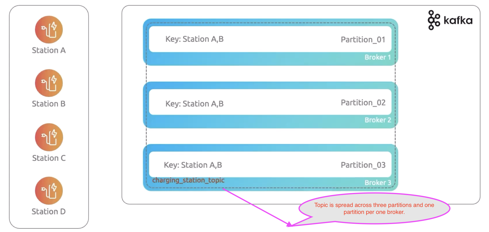

# Building Blocks of Kafka

## Broker

Broker stores and manage the messages in kafka cluster.
Kafka broker is distributed in nature.
Below are the main benefits from kafka broker

**1. Message management:** Kafka broker is basically a storage, and it stores events/messages and retrieved by consumer whenever they need.

**2. Cluster node:** Kafka broker is a node in a cluster. It can be one node or many nodes in the cluster. 
Hence, it can handle multiple messages without any performance degradation.

**3. Scalability:** Kafka broker is scalable easily depends on the workload. 
When it scales, there is no downtime that ensures kafka's stability and reliability.

**4. Fault tolerance:** Kafka broker is distributed in nature. 
Hence, if there is any failure in the broker, the messages can be processed by another kafka broker without data loss.

**5. Dynamic membership:** kafka broker can scale dynamically based on the load without disturbing any running kafka. 
It can join or leave clusters without downtime.

## Topics

Topics are nothing but a place where producers send the message and consumers consume the message.
Topics are not physical entities like brokers.
It is the mechanism or the way to categorize and organize the messages within the broker. 

Below are the characteristics for topics

**1. Message categorization:** Topics are grouping the related messages and organize it logically.

**2. Immutable log:** Topics ensure that messages are stored sequentially and not modified in between.

**3. Multi consumer access:** Topics ensure that multiple consumers can read the messages from the same topic. 

**4. Decoupled communication:** Topic helps to decouple the communication between producers and consumers. 

**5. Replication:** It ensures that replication is available across broker. 
This will ensure that there is no data loss even if something goes wrong.

## Partitions

Partitions and replication help us to avoid the downtime if broker goes down. 

1. Partitions distribute the topic across all brokers. This will help if one of the brokers goes down, other brokers can still serve the data from the topic.

2. Parallelism ensures processing of messages by consumers at the same time. This increases throughput.

3. Partition helps a topic to scale easily when the load goes high and a single broker cannot handle the load.

4. Partition ensures that if one broker goes down and other brokers remain available for fault tolerance.

5. Partition ensures the order of the message in the topic. The order should be sequential. 

**Key points to note**

1. Partition key used to send the message to the same partition.
   For example, if user id used as a key, then all the messages from the user go to the same partition.
   This will avoid it over usage of one partition.

2. Over partitioning and under partitioning are creating a problem. So, proper partitioning helps to achieve the throughput

3. Related data should be in the same partition.

4. Consumer group should have the number of consumers which match the number of partitions. (number of CG = number of partitions)

## Replication

Replication helps us to avoid the data loss when the broker goes down. 
Partitions (leader, follower) are available across the brokers, and the data has been replicated among the partitions.
If the broker which has leader partition goes down,
then the other broker which has follower partition becomes leader and ensures the data is available for consumer.

These are below benefits of replication.

1. High availability 

2. Fault tolerance

3. Scalability

4. Data durability

## Partition Vs Replication

| **S.No** | **Description**         | **Partition**                                 | **Replication**                               |
|----------|-------------------------|-----------------------------------------------|-----------------------------------------------|
| 1        | Purpose                 | Horizontal scaling                            | Survive failures                              |
| 2        | Question to be answered | How do we process the messages faster?        | How do we avoid losing data if a server dies? |
| 3        | Data location           | Distribute the data across brokers            | Copies the data across brokers                |
| 4        | Impact                  | More partitions = More throughput/parallelism | More replicas = More safety                   |

