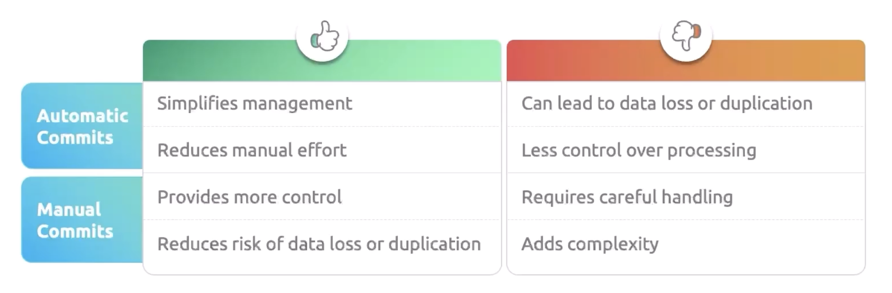

# Consumers

Consumers read the message from the kafka cluster and do processing. It follows pull architecture.


1. Consumers read the message in sequentially (lower offsets to higher offsets).
This ensures that the messages have been read in the order which they produced.

2. Partition independence: Message order is guaranteed within the individual partition, but not across partitions. 
It means consumer will not read the same message in two different partitions. 

## Consumer Group

Consumer group is nothing but a collection of consumers to process the message available in the topics.
Each message will be processed by only one consumer in the consumer group. 


`One message can be processed by only one consumer in consumer group. 
However, the same message can be processed by another consumer which resides in another consumer group as well`

```html
Number of partitions = Number of consumers
```

**Benefits**

1. Scalability: When messages increase, more consumers can be added in the consumer group to handle the load.
2. High Availability: When one consumer goes down, the messages will be automatically handled by another consumer in the consumer group.
3. Parallel Processing: Processing the messages will be parallel, and more messages can be processed in a short time
4. Load Balancing: Distributes the messages between multiple consumers.

## Consumer Rebalancing

Assume that one consumer goes down in the consumer group,
the messages in the partition allocated to that consumer will not be processed.
It will be on hold.
During this failure,
kafka consumer group stops all consumers to process the messages
and will reallocate the partitions to the available consumers.
This is known as consumer rebalancing.

Consumer rebalancing happens during the below situations

1. When consumer goes down or consumer added in the consumer group

2. When consumer group member changes 

3. When consumption pauses.


## Offset Management

Offset is used to track the number of messages consumed by a consumer. Let us try to understand this.

When the producer sends the messages to the topic in a broker, consumer is read that message and process it.
These consumers are part of consumer groups. 
When the consumer starts reading the message and move on one by one.
Let's
say there are 10 messages and consumer 1 starts
reading from 1. The starting point is known as current offset.
After reading three messages, consumer 1 go down for some reason.
As there are three messages read, this point is known as committed offset.
When consumer 2 starts 
reading the messages from 4 onwards as it refers committed offset before it starts reading the message.

`Remember offset is uniquer per partition`


## Offset Management - How does it work?

Kafka brokers are keep track of the messages in the separate topic on a specific interval.
This will ensure how many messages have read by which consumer and which consumer group from which topic,
etc. When the new consumer is added and wants to continue to read the message from the place where old consumer left,
this new consumer refers to the offset management and finds the committed offset.
Once it finds out the committed offset, it will start reading from there.


This entire offset is maintained by consumer, not the kafka.


Offset management is handled in two ways.

1. Manual

2. Automatic



Now, there are four partitions and three consumers (1, 2, and 3) in the consumer group,
and consumer 1 consumes messages from partition 1
and 4. Consumer 2 consumes messages from partition 2, and consumer 3 consumes messages from partition 3.


For some reason, consumer 3 go down.
Then the consumer rebalancing occurs and partition 3 will be consumed by consumer 2 after rebalancing.


Before consumer 2 starts reading the messages from partition 3,
it refers to the offset committed by consumer 3 before it dies.
Once it finds out the offset, then consumer 3 will start reading the messages from the committed offset in partition 3.


## Poison pills

Poison pill is nothing but a message of corruption.
When the producers send the messages with unexpected format,
consumers are unable to read them and unable to process them.
This leads to consumer lag, data loss, and system instability. 

Due to poison pill, below are the consequences.

1. Resource utilization can go high

2. System instability

3. Data loss


## Strategies to handle Poison pills


#### Schema Enforcement

In this strategy,
producers are enforced to follow certain schema (template for the message)
and this schema is registered in schema registry.
When consumers consume the message,
it will check the schema registry and understand the format and validate the message.
If it matches, then it will consume.


#### Dead Letter Queue

In this strategy, when consumer consumes the message and if the message is not in the expected format,
then the consumer will move the message to the dead letter queue (Isolated topics).
Later this message will be analyzed, and reprocessed.


#### Retry

In this strategy, when consumer is unable to consume the message due to some reason, even though the message format is valid, 
then the consumer will retry to process the message after a specified interval.


#### Message Filtering

In this strategy, the consumer checks the message for the mandatory information (message filtering),
and if it exists, it will process the message.
It will not look for all the fields in the message.


