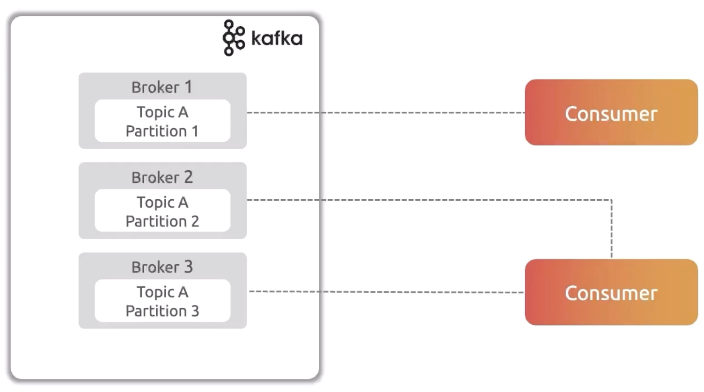

# Consumers

Consumers read the message from the kafka cluster and do processing. It follows pull architecture.



1. Consumers read the message in sequentially (lower offsets to higher offsets).
This ensures that the messages have been read in the order which they produced.

2. Partition independence: Message order is guaranteed within the individual partition, but not across partitions. 
It means consumer will not read the same message in two different partitions. 

## Consumer Group

Consumer group is nothing but a collection of consumers to process the message available in the topics.
Each message will be processed by only one consumer in the consumer group. 


`One message can be processed by only one consumer in consumer group. 
However, the same message can be processed by another consumer which resides in another consumer group as well`

```html
Number of partitions = Number of consumers
```

**Benefits**

1. Scalability: When messages increase, more consumers can be added in the consumer group to handle the load.
2. High Availability: When one consumer goes down, the messages will be automatically handled by another consumer in the consumer group.
3. Parallel Processing: Processing the messages will be parallel, and more messages can be processed in a short time
4. Load Balancing: Distributes the messages between multiple consumers.

## Consumer Rebalancing

Assume that one consumer goes down in the consumer group,
the messages in the partition allocated to that consumer will not be processed.
It will be on hold.
During this failure,
kafka consumer group stops all consumers to process the messages
and will reallocate the partitions to the available consumers.
This is known as consumer rebalancing.

Consumer rebalancing happens during the below situations

1. When consumer goes down or consumer added in the consumer group

2. When consumer group member changes 

3. When consumption pauses.


