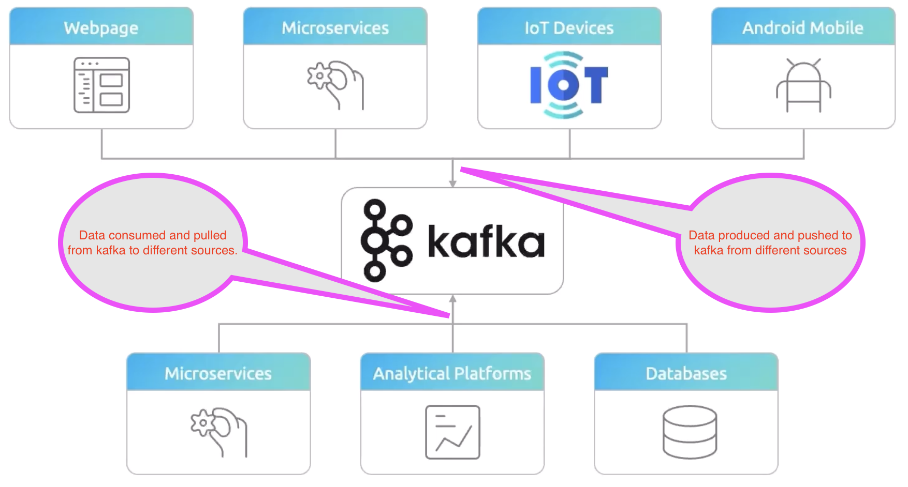
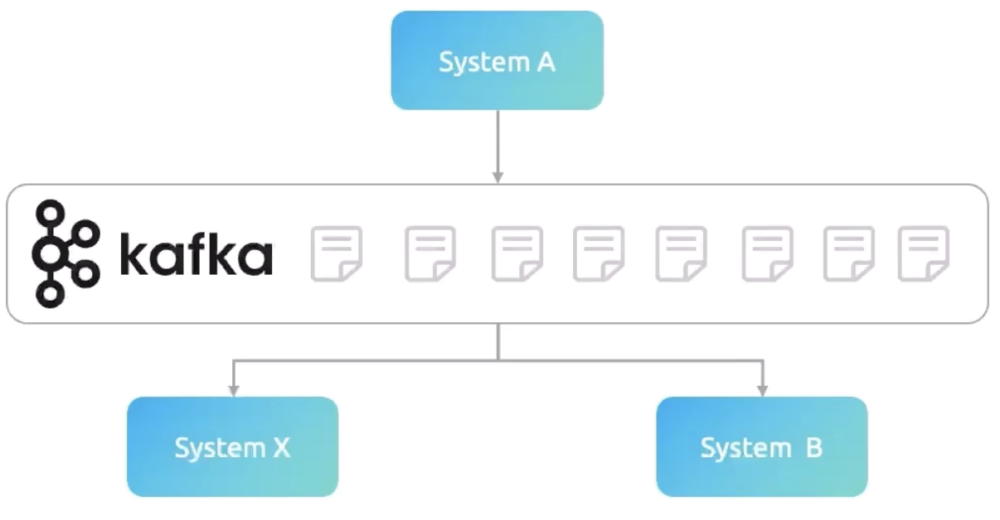

# Event Streaming

<mark>Event streaming is the continuous flow of data and processing in real time.</mark>

## Event Streaming Architecture - Drawbacks

#### Processed events

<mark>When service A produces an event and sends it to kafka broker for service B to consume it.
Once service B consumes the event
and sends back the response to service A. This event is called as processed event</mark>

1. **Tight coupling:** Let us assume one service (service A) depends on another service (service B).If you are making 
a change in service A, this will impact service B as well.
   If service A goes down, service B cannot work.

2. **Reduced scalability:** You cannot scale the services if the load goes high.

3. **Single point of failure:** If service A goes down, service B cannot work. The whole system is unable to perform as expected.

4. **No message persistence:** If your data triggered an event and in queue. 
In case your data lost due to single point of failure, you cannot recover it again.
   There is no persistent storage.

To avoid these drawbacks, Apache kafka comes into the picture. Kafka solves these problems and gives the below benefits

* **High throughput:** It can process millions of data without losing them in a short span.
* **Fault tolerance:** It is distributed, and hence there is no single point of failure. Hence, reliable and highly available.
* **Scalability:** Kafka is highly scalable without any service disruption.

## Introduction - Apache Kafka

Apache kafka is nothing but a distributed event streaming platform and highly scalable for below

1. Creating a real-time data streams
2. Processing a real-time data streams

For example, let's assume it; you are sending a message in WhatsApp in every minute.
This message goes to kafka server.
Similarly,
the same kafka server will receive the message from many people at every minute as well resulting a continuous 
data streams.
<mark>So, bringing your message to kafka server is called as "Creating a real-time data streams".</mark>

Now, your message needs to send it to the recipient within a second or at least within a minute.
So, you have to create an
application which listens to kafka server continuously
and process the real-time data streams as soon as it arrives in kafka 
server.<mark>So,
bringing your message from kafka server to the recipient is called as "Processing a real-time data streams."
</mark>

In the above example, you are the publisher, your recipient is the consumer, and kafka server is a broker.

### Kafka Architecture

### Kafka Components

1. Kafka Broker - This is a kafka server
2. Kafka Client - This is a publisher and consumer
3. Kafka Connect - This helps the data integration 
4. Kafka Streams - This helps to create real-time stream processing
5. KSQL - This helps kafka become to database.

### Kafka Core Concepts

##### 1. Producer:
It is an application to produce the data (message) and send it to kafka server. The data may have different structure, schema.
However, kafka server considers the data as an array of bytes. Assume if you have a database having 10 rows, and your application
reads those 10 rows and sends each row as a message to kafka server, so totally 10 messages to the server.

##### 2. Consumer:
It is an application to receive the data (message) from kafka server.
Consumers can request the data to kafka server from 
any producer as long as they have required permission to the producer.
Consumer requests the data continuously as long as
kafka server provides the data.
Consumer application uses the message; however, it wants.

##### 3. Broker:
This is nothing but a kafka server.
This is called broker because it is a place in between producer and consumer and acts 
as mediator.
<mark>Producers and Consumers DO NOT interact directly.
They use kafka server as a broker to exchange the message.</mark> 

##### Role of broker

A System produces an event and sends it to broker.
System B and system X consume it from the broker.
In this architecture, the System doesn't be aware who is going to consume the events it is generated.
At the same time, System B and System X also don't know where the events are coming from.

##### 4. Cluster:
It is a group of computers acting for common goal. <mark>Each computer instance runs one instance of kafka broker.</mark>

##### 5. Topic:
It is part of kafka server (broker).
One Kafka broker may have many topics, and each topic has unique data.
It is a unique 
name of the data streams.
It is similar to a table in a database.
Producer sends the data to the specific topic, and consumers 
read the data from the topic and process it as long as it has a read permission to that topic.
Creating 'n' of topics is 
depending on architectural design.

##### 6. Partitions:
It is a small portion of the topic.
It can be any size (maybe large storage or small storage). 
The Number of partitions in a topic is also decided by architectural design. 

##### 7. Partitions Offset:
It is a unique id of a message in the partition.
Unique ID is automatically assigned by kafka broker to every message as
it arrives in the partition.
This unique ID will NOT change once it is assigned.
Unique ID starts from 0 for every message,
and it is local to that partitions.

##### 8. Consumer Group:
It is nothing but a group of consumers to share the load.

**NOTE**

<mark>Kafka does NOT allow more than one consumer to read and process the data from the same partition simultaneously.</mark> 

### Kafka - Backbone of event driven architecture

Kafka solves the below problems in the event driven architecture.

1. **High Throughput:** Kafka can process millions of events without any message to be left out.

2. **Fault Tolerance:** Kafka's distributed architecture ensures that high availability and reliable. 
Even one of the systems goes down, kafka ensures that there is no data loss.

3. **Scalability:** Kafka can scale horizontally when the load goes high. It is dynamic in nature.