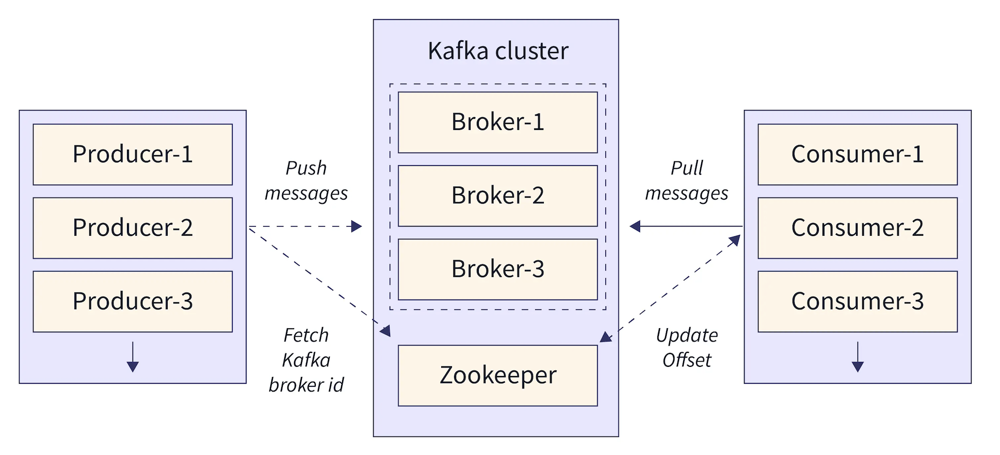
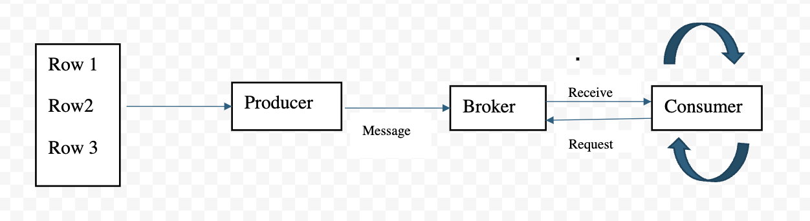

# Introduction - Apache Kafka

Apache kafka is nothing but a distributed platform and highly scalable for below
1. Creating a real-time data streams
2. Processing a real-time data streams

For example, let us assume, you are sending a message in whatsapp in every minute.This message goes to kafka server.
Similarly, same kafka server will receive the message from many people at every minute as well resulting a continuous 
data streams. <mark>So, bringing your message to kafka server is called as "Creating a real-time data streams".</mark>

Now, your message needs to send to the recipient within a second or at least within a minute. So, your have to create an
application which listens kafka server continuously and process the real-time data streams as soon as it arrives in kafka 
server.<mark>So, bringing your message from kafka server to the recipient is called as "Processing a real-time data streams".
</mark>

In the above example, you are the publisher, your recipient is the consumer and kafka server is a broker.

### Kafka Architecture

### Kafka Components

1. Kafka Broker - This is a kafka server
2. Kafka Client - This is a publisher and consumer
3. Kafka Connect - This helps the data integration 
4. Kafka Streams - This helps to create real-time stream processing
5. KSQL - This helps kafka become to database.

### Kafka Core Concepts

##### 1. Producer:
It is an application to produce the data (message) and send it to kafka server. The data may have different structure, schema.
However, kafka server consider the data as an array of bytes. Assume if you have database having 10 rows, and your application
reads those 10 rows and send each row as a message to kafka server, so totally 10 messages to the server.

##### 2. Consumer:
It is an application to receive the data (message) from kafka server. Consumer can request the data to kafka server from 
any producer as long as they have required permission to the producer. Consumer requests the data continuously as long as
kafka server provides the data. Consumer application uses the message however it wants.

##### 3. Broker:
This is nothing but a kafka server. This is called broker because it is place in between producer and consumer and acts 
as mediator. <mark>Producers and Consumers DO NOT interact directly. They use kafka server as a broker to exchange the message.</mark> 

##### 4. Cluster:
It is a group of computers acting for common goal. <mark>Each computer instance runs one instance of kafka broker.</mark>

##### 5. Topic:
It is part of kafka server (broker). One Kafka broker may have many topics and each topic has unique data. It is unique 
name of the data streams. It is similar to table in database. Producer send the data to the specific topic and consumers 
read the data from the topic and process it as long as it has a read permission to that topic. Creating 'n' of topics is 
depends on architectural design.

##### 6. Partitions:
It is a small portion of the topic. It can be any size (may be large storage or small storage). 
Number of partitions in a topic is also decided by architectural design. 

##### 7. Partitions Offset:
It is an unique id of a message in the partition. Unique ID is automatically assigned by kafka broker to every message as
it arrives in the partition. This unique ID will NOT change once it is assigned. Unique ID starts from 0 for every message
and it is local to that partitions.

##### 8. Consumer Group:
It is nothing but a group of consumers to share the load.

**NOTE**

<mark>Kafka does NOT allow more than one consumer to read and process the data from the same partition simultaneously.</mark> 
