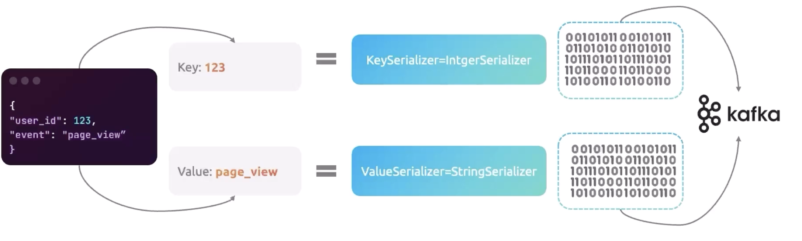
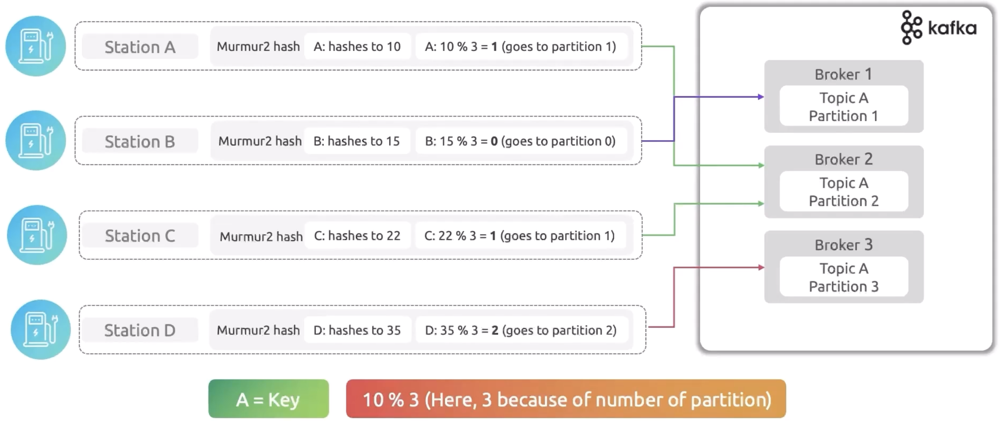
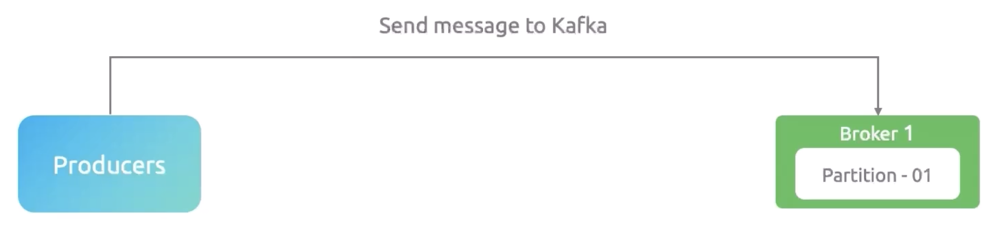
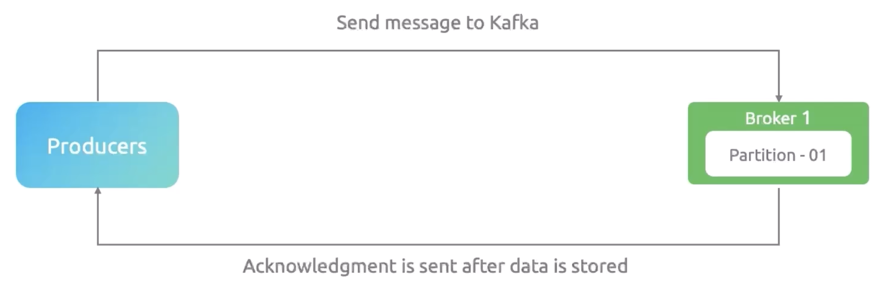
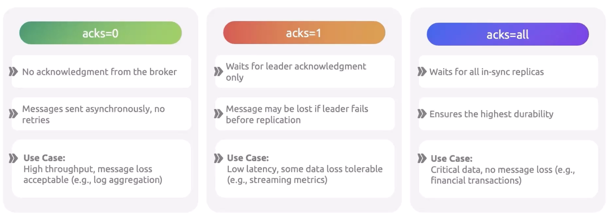

# Producers

**Overview of Food delivery platform example**


Producers are responsible to send the message to kafka brokers. It can be a microservice, or IoT device, etc. 
It writes a message on a topic which resides in kafka brokers.


## Producers Configuration 

| **S.No** | **Config Parameter** | **Description**                                                     |
|----------|----------------------|---------------------------------------------------------------------|
| 1        | Bootstrap server     | Broker address where the topic resides and message needs to be sent |
| 2        | Key serializer       | How to convert key to bytes                                         |
| 3        | Value serializer     | How to convert messages to bytes                                    |
| 4        | Acks                 | Acknowledgement level (0, 1, all)                                   |
| 5        | Compression type     | gzip, snappy, zstd, iz4                                             |
| 6        | Retries              | Number of retry attempts                                            |
| 7        | Batch size           | Batch messages for efficiency                                       |


## Serialization in Kafka

Kafka producers send a message in human-readable format. In general, below are few formats

1. **JSON** - Less efficiency than binary format
2. **Apache avro** - Binary format with schema definition
3. **Protobuf (Protocol Buffer)** - Efficient binary format

However, Kafka brokers store the messages in bytes.
It cannot store in human-readable format.
So, converting human-readable messages into bytes called as serialization.
Serialization is considered as additional security of the kafka messages.

Let us assume that the below message needs to be sent to a kafka topic.

```html
{
    "userId": 123,
    "Password": "password@123#"
}
```
The key is 123, and the value is password@123#.
The Key is converted into integer serializer, and the value is converted into string serializer.
We can select the serializer based on the type of value.




## Role of Message Key (How to decide a message goes to which partition)

The key value of the message will be deciding which partition this message needs to go.
To do that, kafka uses murmur2 hash algorithm.
This algorithm gets the key value and converts into hash value.
This hash value is further used to calculate to find out the partition number.
Once the partition number is identified, then the message goes to that partition.

The below formula is used in murmur2 hash algorithm.

```html
Message hash value % number of partition = partition number
```




## Acknowledgement

Acknowledgement ensures that the message from producer received by kafka cluster.
This is the kind of receipt that acknowledges a message has been received. 

There are three different levels of acknowledgements.

| **S.No** | **Acknowledgement Level** | **Description**                                                   |
|----------|---------------------------|-------------------------------------------------------------------|
| 1        | 0                         | No acknowledgement. Data loss is possible                         |
| 2        | 1                         | Acknowledgement from leader broker. Limited data loss is possible |
| 3        | all                       | Acknowledgement from all brokers. No data loss                    |


### Acknowledgement = 0

Producer sent a message to the kafka topic in the kafka cluster.
However, the producer didn't get any acknowledgement from kafka cluster that it receives the message.
Hence, there is no guarantee that the message is reached the kafka cluster.
So, data loss is possible.





### Acknowledgement = 1

Producer sent a message to the kafka topic in the kafka cluster.
Kafka leader broker stores the message and then sent an acknowledgement to producer that it receives the message.
Hence, this will not store the message in follower brokers.
So, if the leader broker goes down, then there is a possibility of data loss.



### Acknowledgement = all

Producer sent a message to the kafka topic in the kafka cluster.
Kafka leader broker stores the message in leader and follower brokers, and then sent an acknowledgement to producer that it receives the message.
So, even if the leader broker goes down, follower broker has the message.
Hence, there is no data loss.


### Acknowledgement Summary




