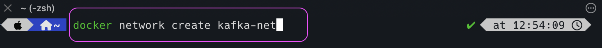
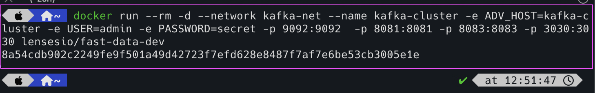
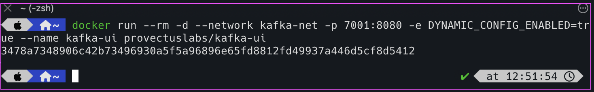

# Setup Kafka Cluster

We are setting up the kafka cluster in local machine using docker.
Along with it, we are going to set up kafka UI as well.

**Step # 1: Create docker network**

```html
docker network create kafka-net
```




**Step # 2: Create kafka cluster container**

```html
docker run --rm -d --network kafka-net --name kafka-cluster -e ADV_HOST=kafka-cluster -e USER=admin -e PASSWORD=secret -p 9092:9092  -p 8081:8081 -p 8083:8083 -p 3030:3030 lensesio/fast-data-dev
```



**Step # 3: Create kafka UI container**

```html
docker run --rm -d --network kafka-net -p 7001:8080 -e DYNAMIC_CONFIG_ENABLED=true --name kafka-ui provectuslabs/kafka-ui
```


