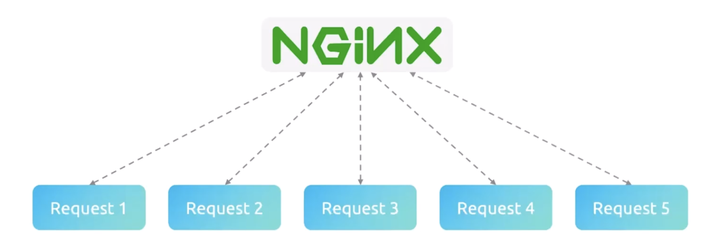
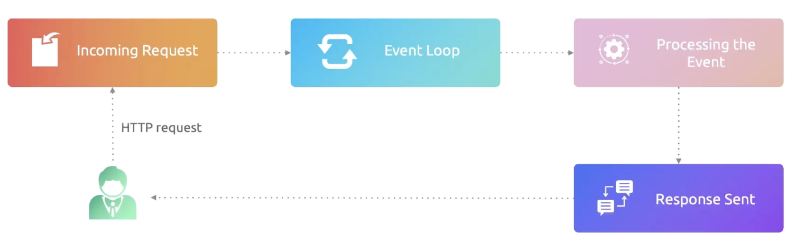
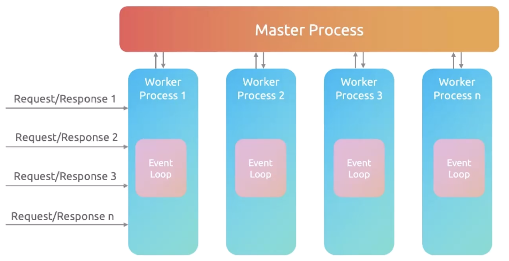
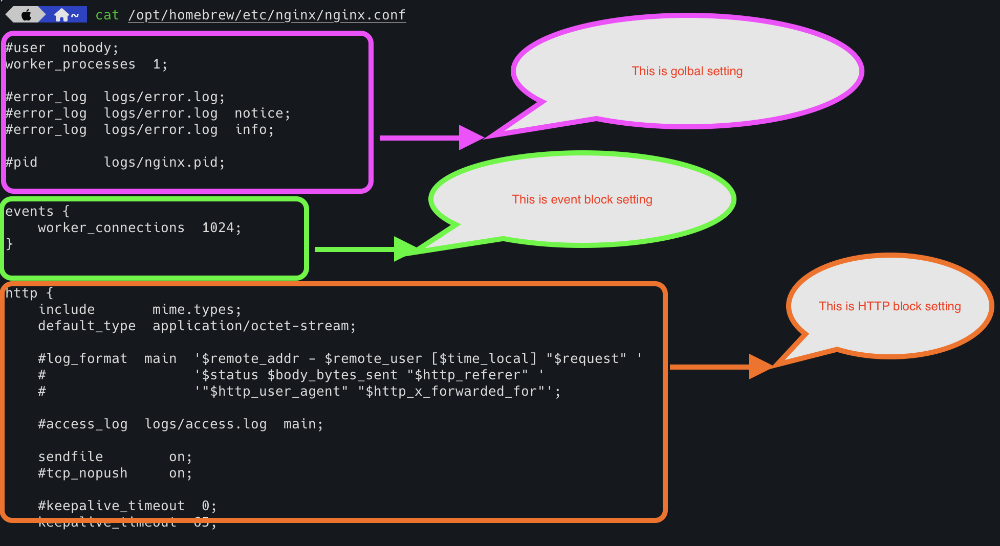
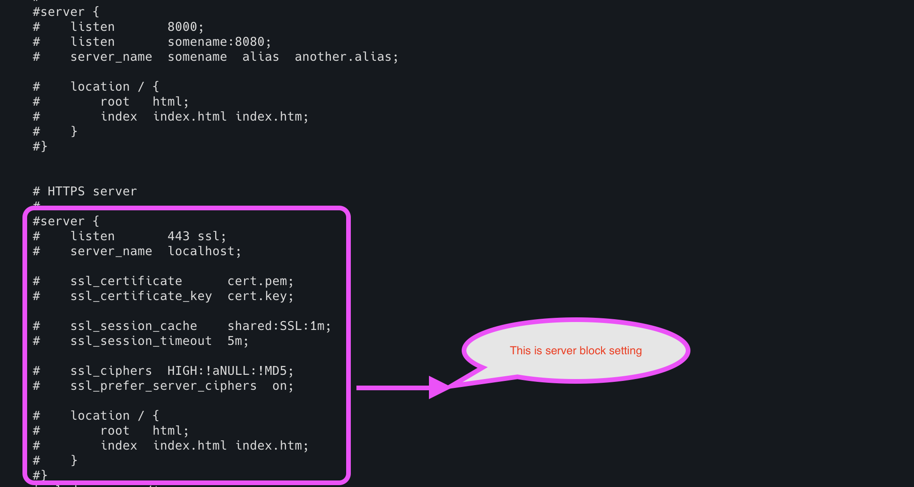
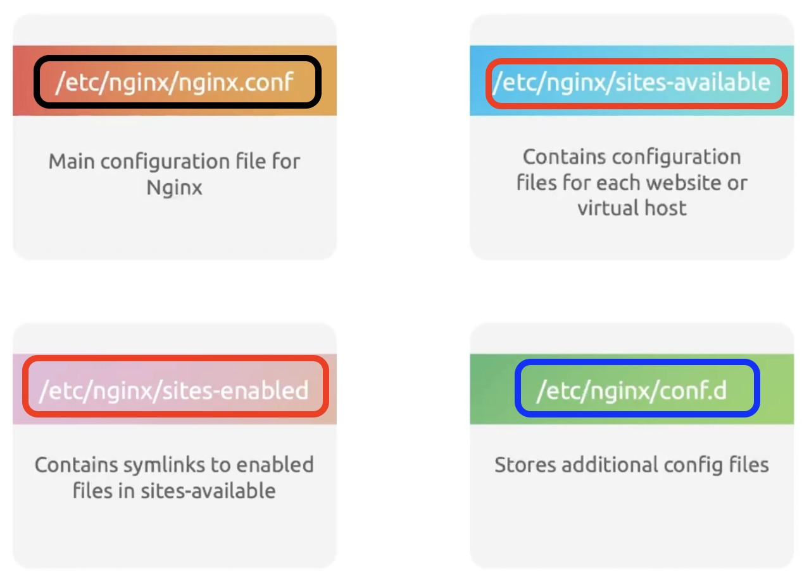
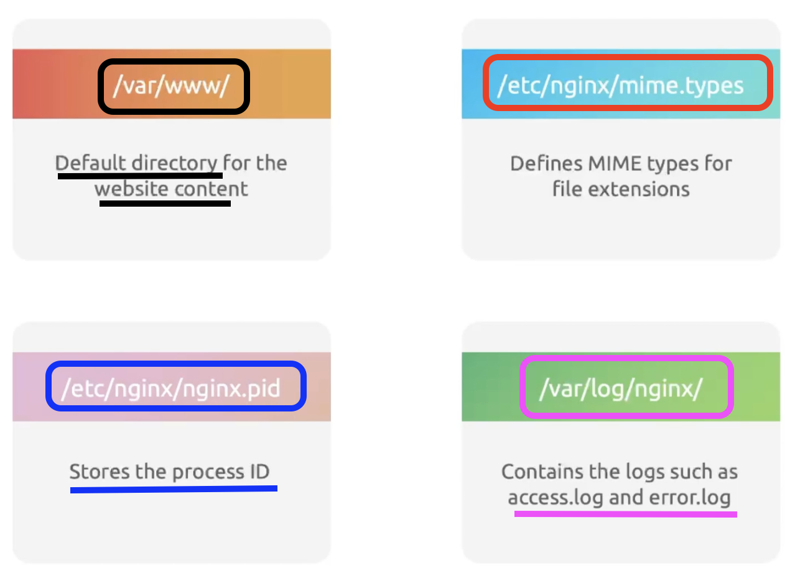

# NGINX - A Web Server

## What is Webserver?

<mark>Web server is nothing but a server which contains the collection of web pages,
and it serves the web page based on the incoming request.</mark>
When the user makes a request (website) from browser, it goes to DNS,
and fetches the IP address of the website's web server.
Then, the request is redirected to the web server, and the web server responds with the web page to the request.

**Examples of Web servers :** Apache, IIS, Litespeed, Caddy, NGINX, and Openresty

## Introduction to NGINX

NGINX is a web server.
1. It is much better than Apache and IIS in terms of performance.
2. For example, NGINX can support 4x connections with half of the resources which Apache/IIS consumes.
3. <mark>It has the best feature to serve the static content efficiently.</mark>
4. <mark>It has features like caching, rate limiting, load balancing, data compression, connection handling, etc.</mark>
5. NGINX serves as 
      1. Load balancer
      2. Reverse proxy
      3. Forward proxy
      4. Cache

## Architecture of NGINX

NGINX follows <mark>event-driven architecture.
The multiple incoming requests are handled parallel,
and it is called as asynchronous processing.</mark> So, it is non-blocking and fast.

When the customer makes incoming request (HTTP/HTTPS),
it goes to NGINX, and NGINX will log the request and put them into loop.
Then NGINX looks for a new event to serve without blocking new requests.
Then the incoming request will be processed.
In case, if the incoming request required some data from DB or third party services, it will go to waiting state.
While it is in waiting state, NGINX will pick another request from loop (instead of pausing) and start processing it.
Once the data is received,
it switches from the current loop to old one and finishes the processing and sends the response back to the customer.  

<mark>Here event loop is crucial as it accepts the incoming requests, log them and pass them to process the event.
Then it goes back to look for another incoming request.</mark>

## Request Handling in NGINX

<mark>NGINX follows Master - Worker architecture to process the request.
Hence, it serves multiple requests simultaneously</mark>

* Master manages the worked processes and ensures that they are up, working/serving multiple incoming requests.
In case, if the worker process is down, it will handle the restart the worker process or update the configuration etc.
* <mark>Master never handles any incoming request.
Instead, it assigns them to a worker process and manages them.</mark>
* Worker processes are running independent using event-driven approach. 
* <mark>Worker processes are serving the incoming requests and ensure that event loop is logging the request 
and then immediately checking for the new event.</mark>

## Structure of NGINX Configuration File

NGINX configuration file has four different sections.

##### Global settings
<mark>This setting affects the entire NGINX server.</mark>
This is the place where you can configure the privileged user details, number of workers, caching, rate limiting, etc.

* **User:** NGINX runs as a service with the user mentioned here.
* **Worker_processes:** Worker processes are decided based on the CPU core of the server. 
If the server has four CPU core, then there are four worker processes run.
However, <mark>setting this option is "auto"
  would be perfect and NGINX will decide the number of worker processes.</mark>
* **pid:** <mark>This is the path where the “master” process identifier stores.</mark>
  Whenever we give some signals (restart, reload, shutdown), 
this will go to this pid and master will decide the action based on the signal.

##### Events block
This is managing the connections like how many worker connections for each worker process,
how the worker process picks the incoming request to process, etc.

* **worker_connections:** <mark>The number of maximum simultaneous connections can be performed by one worker process.
For example, if the server has four CPU core, then four worker processes can run by master.
  Each worker process can support 1024
  (mentioned in the snapshot. It can change as per our need) simultaneous connections.
  As we have four worker processes, it can support 4 x 1024 connections in parallel.
  </mark>

##### HTTP block
This is the setting where we can handle the web traffic. This includes server block as well.
We can configure security setting, HTTP optimization techniques such as caching, rate limiting, data compression, etc.
You can create one server block for one website.
If you have multiple websites, you can create multiple server blocks and configure NGINX setting for each website.

`
NOTE: You can have one server block and can have multiple websites as well. 
But that is not preferable as one changes impacts multiple websites.
`

<mark>Here we can configure all HTTP related configurations, log format, rate limiting, cache details,
keep-alive settings, and other global configurations.</mark>

##### Server block
This is the key configuration.
This is where we can inform NGINX how it should behave for each domain and subdomain requests. 

* **listen:** This is the port NGINX should listen for incoming traffic. `Port 80` for HTTP traffic and `Port 443` for HTTPS traffic.
* **server_name:** This is the domain name or subdomain name which a user enters in their browser
* **root:** This is the directory where all the website files are available. Your `index.html` file should be here in the path.
* **location /:** This is the landing page. 
* **try_files /:** This looks for the file under the root location. If it finds, then it serves the webpage. 
If it didn't find, then it will return as 404 error page.

## Important NGINX Configuration Files

## NGINX Commands

| **S.No** | **Command** | **Description**                                           |
|----------|-------------|-----------------------------------------------------------|
| 1        | nginx -v    | Gives NGINX version                                       |
| 2        | nginx -h    | Describes the command and its details                     |
| 3        | nginx -t    | Validate the configuration file (nginx.conf)              |
| 4        | nginx -T    | Useful for sharing config when seeking support            |    
| 5        | nginx -V    | Gives NGINX build version, config info and module details |
| 6        | nginx -s    | Gives signal to master to perform an action               |
