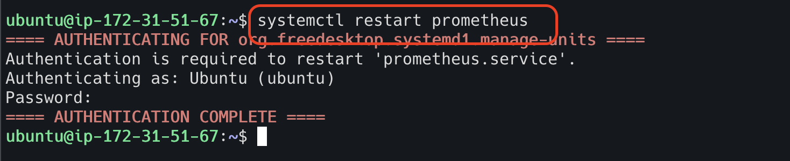

# Authentication & Encryption

I am running three different EC2 instances in my AWS account.
Out of these three machines,
two machines are having prometheus (one is an actual prometheus server and another one is normal ubuntu)
and one machine has a node exporter.
The goal is prometheus server should scrape the node server metrics, 
and ubuntu server should not scrape the node server metrics.


As of now, both ubuntu server and prometheus server are scraping the metrics.

 


This goal can be achieved using authentication and encryption.

## Authentication

**Step 1 - Create directories and assign permissions in the node server**

```html
sudo mkdir /etc/node_exporter
sudo touch /etc/node_exporter/config.yml
sudo chmod 700 /etc/node_exporter
sudo chmod 700 /etc/node_exporter/config.yml
sudo chown -R node_exporter:node_exporter /etc/node_exporter 
sudo systemctl daemon-reload
sudo systemctl restart node_exporter.service 
```


**Step 2 - Create password for node server for authentication**

```html
sudo apt update
sudo apt install apache2-utils -y
htpasswd -nBC 10 "" | tr -d ':\n'; echo
```


**Step 3 - Update password in the node server configuration**

Update the node server configuration file located at `/etc/node_exporter/config.yml`

```html
vi /etc/node_exporter/config.yml

basic_auth_users:
  <username>: <password in hash format>
```


**Step 4 - Update the node service and restart the node server**

```html
[Service]
User=node_exporter
Group=node_exporter
Type=simple
ExecStart=/usr/local/bin/node_exporter --web.config=/etc/node_exporter/config.yml

[Install]
WantedBy=multi-user.target
```


Restart the node server

```html
sudo systemctl restart node_exporter.service
curl -u <username>:<password> http://<hostname>:<port>/metrics
```


**Step 5 - Update the authentication in prometheus server**

Update the authentication in prometheus configuration located at `/etc/prometheus/prometheus.yml`

```html
basic_auth:
  username: <username>
  password: <password in plain text>
```


**Step 5 - Restart prometheus server**

```html
sudo systemctl restart prometheus
```



## Encryption

**Step 1 - Create certificates for node server**

```html
openssl req -new -newkey rsa:2048 -days 365 -nodes -x509 -keyout node_exporter.key -out node_exporter.crt -subj 
"/C=US/ST=California/L=Oakland/O=MyOrg/CN=localhost" -addext "subjectAltName = DNS:localhost"
```


**Step 2 - Copy certificates to node server location**

```html
sudo cp node_exporter.* /etc/node_exporter/
sudo chown -R node_exporter:node_exporter /etc/node_exporter
```


update the node server configuration file

```html
tls_server_config:
  cert_file: <path of crt file>
  key_file: <path of key file>
```


Restart node server

```html
sudo systemctl daemon-reload
sudo systemctl restart node_exporter.service
```

**Step 3 - Copy node server certificates to prometheus server**

```html
scp <username>@<node server hostname>:/etc/node_exporter/node_exporter.crt /opt/prometheus/node_exporter.crt
```


**Step 4 - Update prometheus configuration**

Update the prometheus configuration located at `/opt/prometheus/prometheus.yml` for a node job

```html
scheme: https
tls_config:
  ca_file: /etc/prometheus/node_exporter.crt
  insecure_skip_verify: true
```


**Step 5 - Restart the prometheus server**

Restart the prometheus server

```html
sudo systemctl restart prometheus
```

Now prometheus server is able to connect and scrape the metrics for node server.


However, ubuntu server is unable to connect the node server because it does not be authorized to connect the node server.

