# Docker Engine & Container Monitoring

We can monitor the docker engine and docker containers in prometheus. 

I am using EC2 instance (my ubuntu server)
where docker engine is running and another EC2 instance where prometheus server is running that will scrape docker engine
and containers metrics from my ubuntu server.

## Docker Engine Monitoring

**Step 1 - Update docker daemon configuration**

Create/update the docker daemon file located at `/etc/docker/daemon.json`

```html
{
  "metrics-addr": "0.0.0.0:9323",
  "experimental": true
}
```

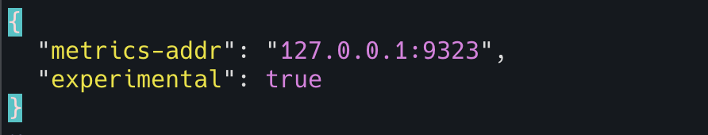

**Step 2 - Restart docker engine**

Run the following command to restart the docker

```html
systemctl restart docker
```

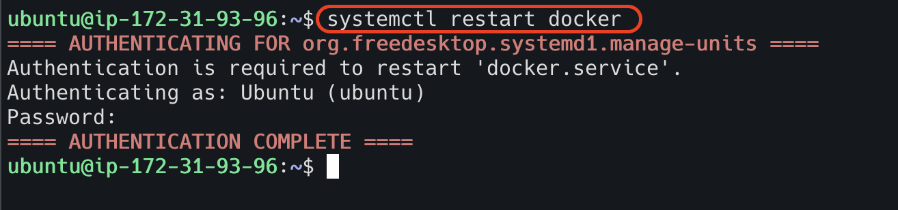


**Step 3 - Check locally if the docker metrics are visible**

Run the following command to see if the docker metrics are visible

```html
curl http://localhost:9323/metrics
```

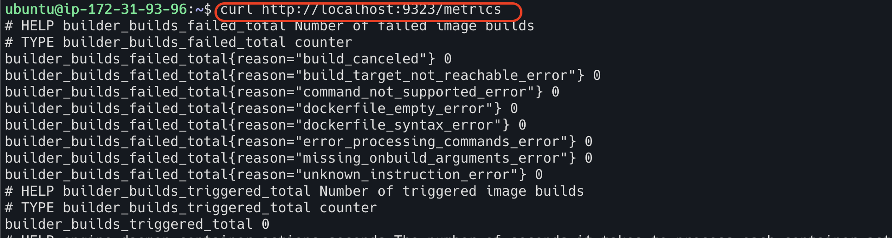

**Step 4 - Configure prometheus to scrape the docker machine**

Update the prometheus configuration file located at `/opt/prometheus/prometheus.yml`

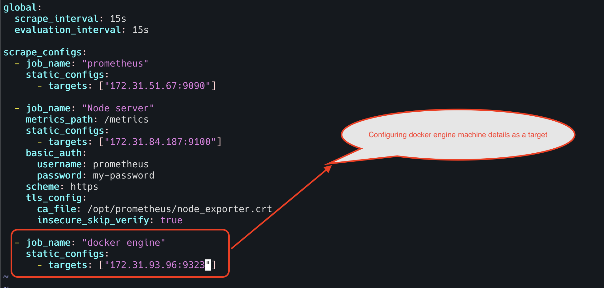


**Step 5 - Restart prometheus**

Run the following command to restart the prometheus server

```html
systemctl restart prometheus
```

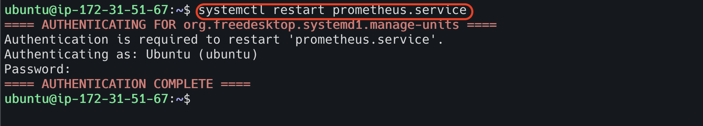


**Step 6 - Check the target status in prometheus UI**

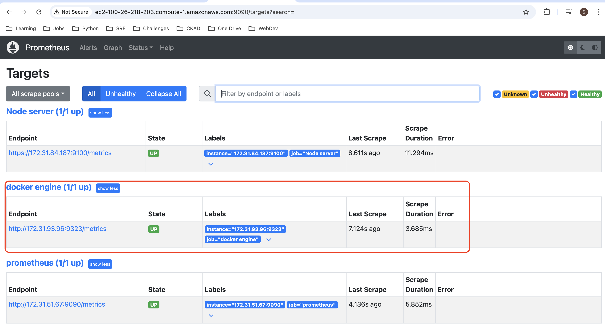

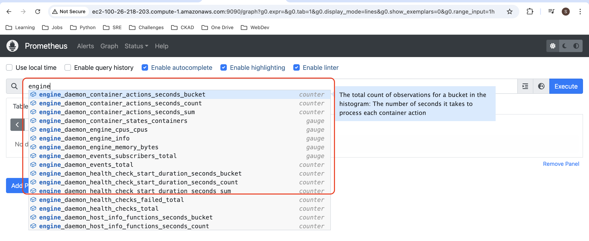

## Docker Containers Monitoring

To monitor docker containers, we need cAdvisor to run on the machine.

cAdvisor (Container Advisor) is an open-source tool by Google that provides container users with an understanding of 
the resource usage and performance characteristics of their running containers, offering detailed real-time metrics 
about CPU, memory, file and network usage.

I am using EC2 instance (my ubuntu server)
where cAdvisor is running and another EC2 instance where prometheus server is running that will scrape docker containers
metrics from my ubuntu server.

**Step 1 - Run cAdvisor in ubuntu server**

Create the docker compose file (anywhere in the machine) and run it.

```html
version: '3.4'
services:
  cadvisor:
    image: gcr.io/cadvisor/cadvisor
    container_name: cadvisor
    privileged: true
    devices:
      - "/dev/kmsg:/dev/kmsg"
    volumes:
      - /:/rootfs:ro
      - /var/run:/var/run:ro
      - /sys:/sys:ro
      - /var/lib/docker/:/var/lib/docker:ro
      - /dev/disk/:/dev/disk:ro
    ports:
      - 8070:8080
```

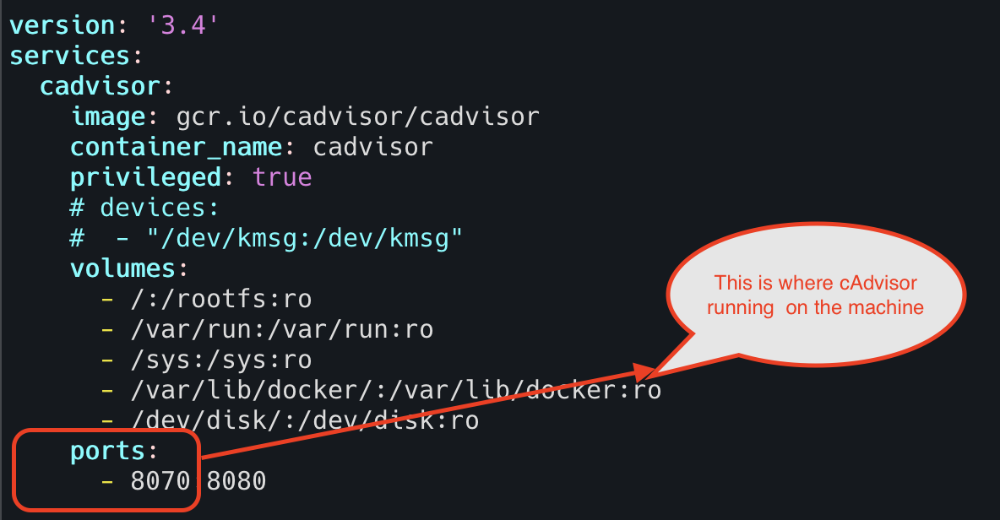

To run the docker compose file, go to the file location and run the below command

```html
docker compose up -d
```

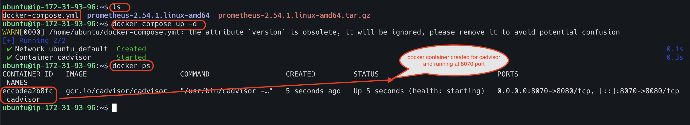

**Step 2 - Check docker container metrics scrape or not in ubuntu server**

Run the command

```html
curl localhost:8070/metrics
```

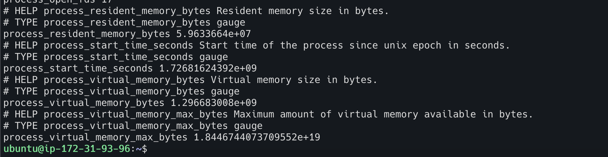

As per the snapshot, container metrics are scraped locally in the ubuntu server machine.

**Step 3 - Integrate cAdvisor with Prometheus**

Update the prometheus configuration file located at `/opt/prometheus/prometheus.yml`

```html
  - job_name: 'cadvisor'
    scrape_interval: 5s
    static_configs:
      - targets: ['<ubuntu server ip>:8070']
```

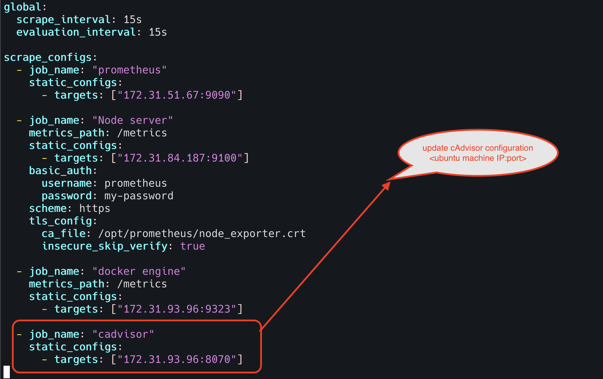

**Step 4 - Restart Prometheus**

Run the following command to restart the prometheus server

```html
systemctl restart prometheus
```


**Step 5 - Check the target status in prometheus UI**

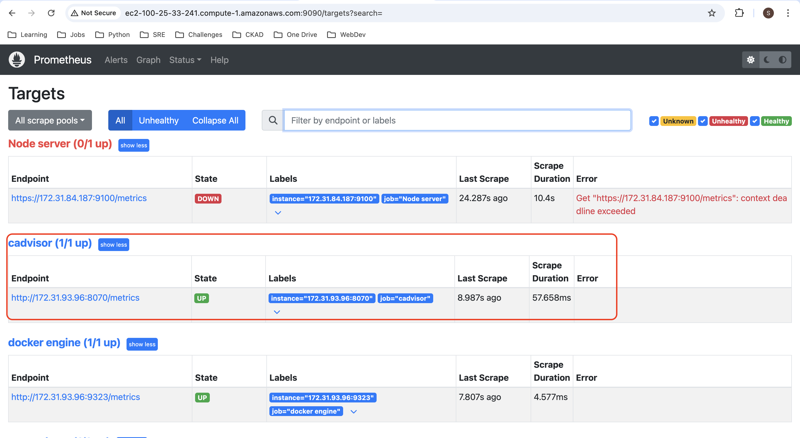

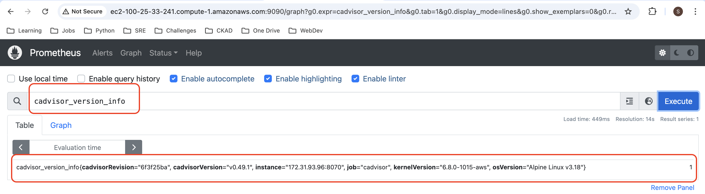
