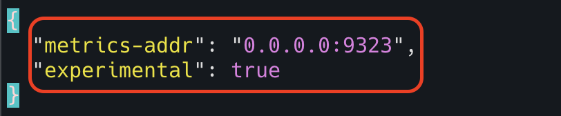

# Docker Engine & Container Monitoring

We can monitor the docker engine and docker containers in prometheus. 

I am using EC2 instance (my ubuntu server)
where docker engine is running and another EC2 instance where prometheus server is running that will scrape docker engine
and containers metrics from my ubuntu server.

## Docker Engine Monitoring

**Step 1 - Update docker daemon configuration**

Create/update the docker daemon file located at `/etc/docker/daemon.json`

```html
{
  "metrics-addr": "0.0.0.0:9323",
  "experimental": true
}
```



**Step 2 - Restart docker engine**

Run the following command to restart the docker

```html
systemctl restart docker
```


**Step 3 - Check locally if the docker metrics are visible**

Run the following command to see if the docker metrics are visible

```html
curl http://localhost:9323/metrics
```


**Step 4 - Configure prometheus to scrape the docker machine**

Update the prometheus configuration file located at `/opt/prometheus/prometheus.yml`


**Step 5 - Restart prometheus**

Run the following command to restart the prometheus server

```html
systemctl restart prometheus
```


**Step 6 - Check the target status in prometheus UI**


