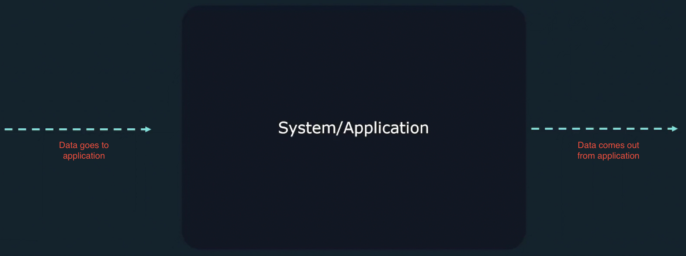
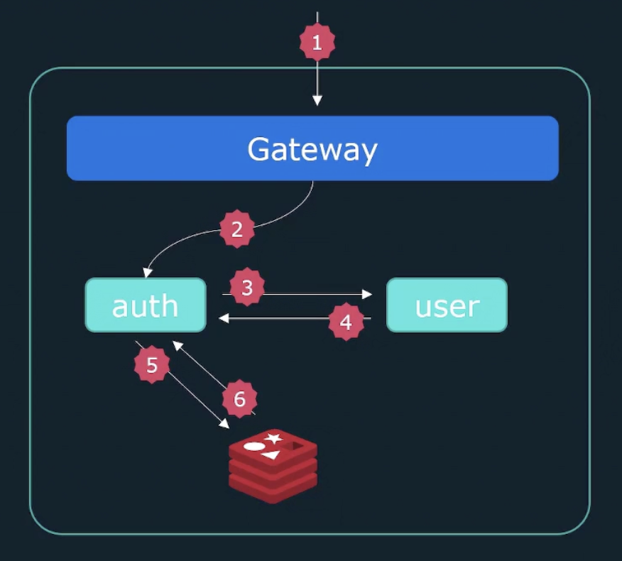
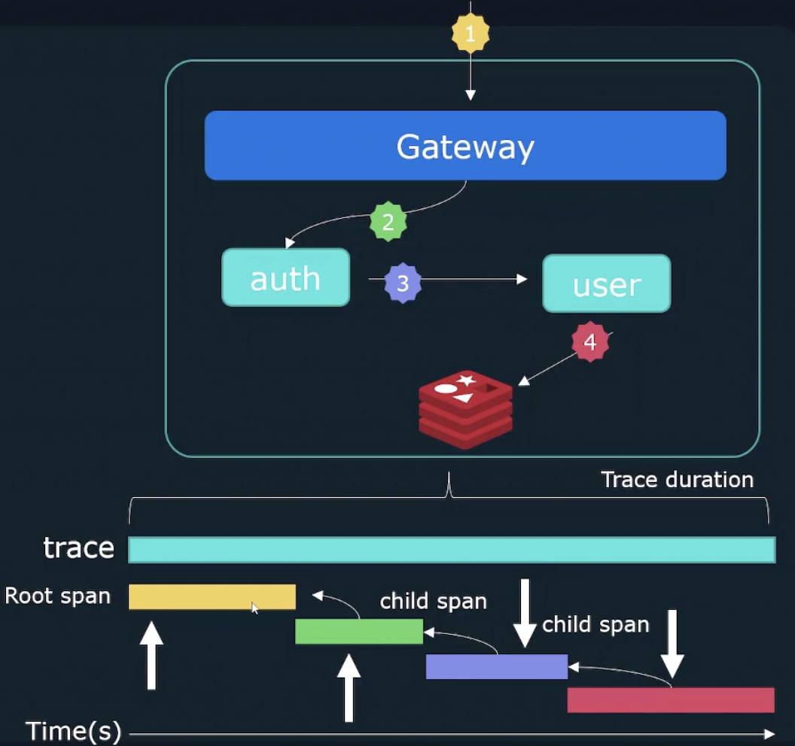

# Observability

Observability is nothing but <mark>the ability to understand and measure the state of the system based on the data generated
by the system.</mark>

Observability helps:

1. Give insights of the internal working of a system/application
2. Monitoring the application
3. Speed up the troubleshooting process
4. Detect the problem that is hard to catch

Without observability in place,
your application is just blind because the data goes to your application and the data comes out of the application.
You never know what is going on inside your application.

Microservice based applications and distributed system must need observability in place. There are so many 
internal components are talking to each other, and when a problem occurs, we need to figure out which component 
is causing the problem, and what is the reason for the problem. This will help us to avoid the problem in the future.

Examples:
1. Why is the error rate suddenly increasing?
2. Why is the latency increase?
3. Why is the service getting timeout?
4. Why is the database query taking so long?

There are three pillars of observability

1. Logging
2. Traces
3. Metrics

### Logging

Logs are record of events that occurred and provide information about that event. The Log contains two important fields.

1. Timestamp
2. Message

### Traces

Traces are allowing us to follow as it traverses an end to end flow involving various systems and services.
It helps us to view individual request flow through different system hop by hop. 

When you send a request to your application, you can watch it go through each layer (system by system) and you can see 
how the request and response work in each system.

1. Each request has trace id (unique one) that helps to identify the request in each layer.
2. Individual events occur in each layer forms a trace, and it is called as spans.
3. Each span has 
   1. Duration
   2. Parent ID
   3. Start time

### Metrics

It provides the information about the state of the system by using numerical values.
The data can be collected over a period of time and aggregated to help identify the trend over time.
 
**Examples:**

* Number of errors
* Response time
* CPU utilization
* Disk space
* Memory utilization

Metrics contain the following components

1. Metric name
2. Metric value (current or recent one)
3. Timestamp
4. Dimensions (Additional information about the metrics)

When you design a system, it is important to set the target/measurable goals to help the organization to make it the 
right balance between a development and operational team. This helps to ensure the reliability of the product and 
customer's confidence about the product.

To do so, there are few parameters that need to be defined. They are below

### Service Level Indicator (SLI)

<mark>It is nothing but a quantitative measure of the service that we provide.</mark>

**Example:** 

1. Availability - Uptime should be 99%
2. Latency - Request latency should be less than 100ms.

<mark>When you set SLI, always consider customer/user perspective. Not all metrics are a good SLI.</mark>

### Service Level Objective (SLO)

<mark>It is a target value or range of SLI.</mark>

**Example:** 

1. If we are considering SLI for latency/response time to quantify your product reliability, then we should align it with 
SLO. It means we are setting the target value for latency. Latency should not exceed 100ms. This is nothing but a SLO.
2. Availability is SLI and 99% uptime is SLO.

### Service Level Agreement (SLA)

<mark>It is just a contract between vendor and user that guarantees SLO.</mark> If not meeting SLO, there could be a penalty.

