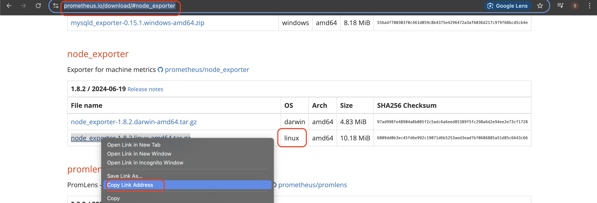
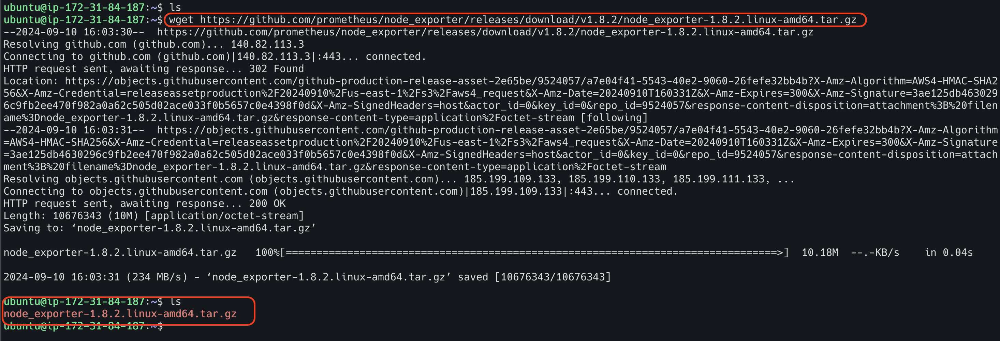
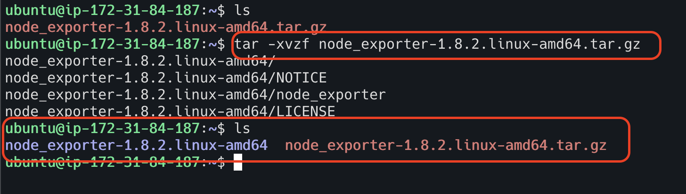
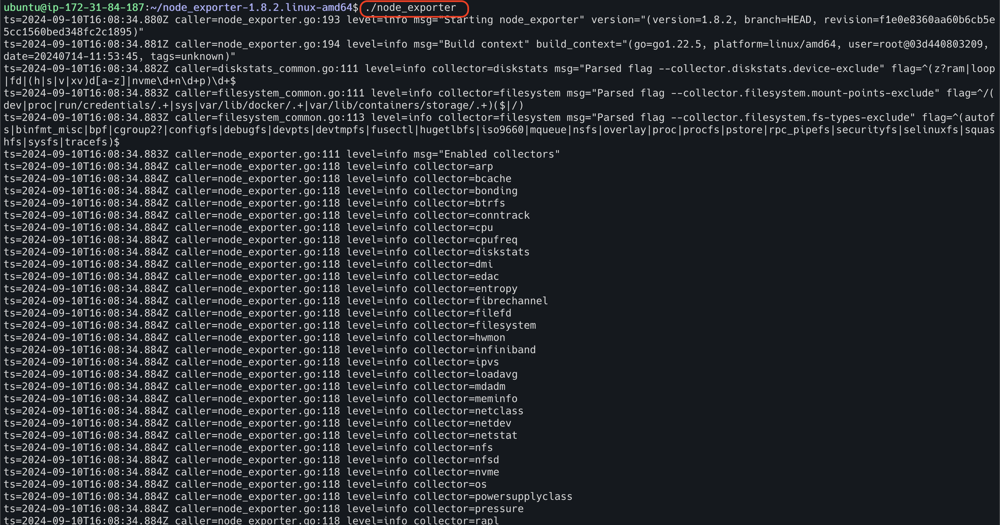
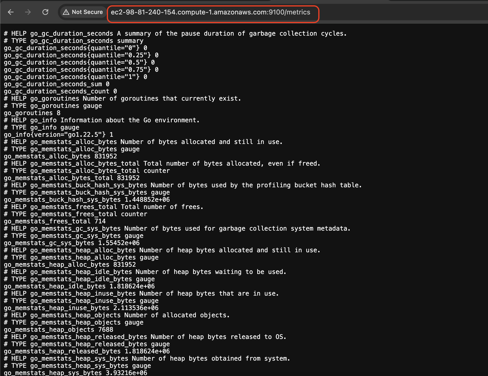

# Node Exporter Installation

I am using linux ubuntu machine for this installation. I spin up linux ubuntu machine in AWS cloud, and it is up and running.
I have also connected EC2 instance using iterm terminal in my Mac machine.

**Step 1**

Go to the website "https://prometheus.io/download/#node_exporter" and find the latest version of node exporter tar file.
Copy the link for that tar file.

**Step 2**

Run the command "wget <copied link>" in the terminal to download the tar file.

`wget https://github.com/prometheus/node_exporter/releases/download/v1.8.2/node_exporter-1.8.2.linux-amd64.tar.gz`

**Step 3**

Untar the downloaded file using the command "tar -xvzf <filename>.

`tar -xvzf node_exporter-1.8.2.linux-amd64.tar.gz`

**Step 4**

Navigate to node exporter directory (unzipped one)

**Step 5**

Start the node exporter executable file

**Step 6**

Open the browser and enter node exporter server IP followed by port number 9100.

***
Node exporter is up and running now.
However, if I close the terminal where node exporter executable is running or my EC2 instance si down,
then the node exporter also stops. Hence, this is not the ideal way to run the node exporter. 
The ideal way of running node exporter is to install and run as a service (systemd).
***

