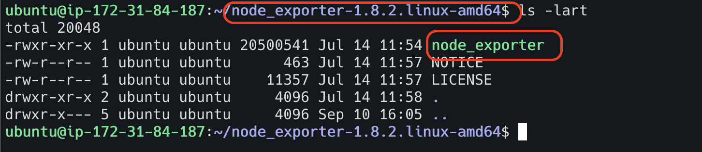

# Node Exporter Installation

I am using linux ubuntu machine for this installation. I spin up linux ubuntu machine in AWS cloud, and it is up and running.
I have also connected EC2 instance using iterm terminal in my Mac machine.

**Step 1**

Go to the website "https://prometheus.io/download/#node_exporter" and find the latest version of node exporter tar file.
Copy the link for that tar file.


**Step 2**

Run the command "wget <copied link>" in the terminal to download the tar file.

`wget https://github.com/prometheus/node_exporter/releases/download/v1.8.2/node_exporter-1.8.2.linux-amd64.tar.gz`


**Step 3**

Untar the downloaded file using the command "tar -xvzf <filename>.

`tar -xvzf node_exporter-1.8.2.linux-amd64.tar.gz`


**Step 4**

Navigate to node exporter directory (unzipped one)



**Step 5**

Start the node exporter executable file


**Step 6**

Open the browser and enter node exporter server IP followed by port number 9100.


***
Node exporter is up and running now.
However, if I close the terminal where node exporter executable is running or my EC2 instance is down,
then the node exporter also stops. Hence, this is not the ideal way to run the node exporter. 
The ideal way of running node exporter is to install and run as a service (systemd).
***

**The ideal way of running node exporter as a service.** 

**Step 1 - Create a system user for node exporter**

System username is `node_exporter`.
Before doing it, we need to ensure `node_exporter` user is not created yet. 

To do so, run the command `cat /etc/passwd | grep -i node_exporter`
If it returns value, it means `node_exporter` user is already available in the system.

We can create system user now. To create the user, run the below commands

```html
sudo useradd --no-create-home --shell /bin/false node_exporter
```


To check if the user is created successfully, run the command 

```html
cat /etc/passwd | grep -i node_exporter
```


**Step 2 - Copy the executable file to bin location**

To copy the node exporter to bin location, run the below commands

```html
sudo cp node_exporter /usr/local/bin/
```


**Step 3 - Assign permission and ownership to the system user**

To assign the ownership to `node exporter` user, run the below commands

```html
sudo chown node_exporter:node_exporter /usr/local/bin/node_exporter
```


**Step 4 - Create a service file for node exporter**

Update the below content in the node exporter service file located at `/etc/systemd/system/node_exporter.service`

```html
[Unit]
Description=Node Exporter
Wants=network-online.target
After=network-online.target

[Service]
User=node_exporter
Group=node_exporter
Type=simple
ExecStart=/usr/local/bin/node_exporter
Restart=always
RestartSec=3

[Install]
WantedBy=multi-user.target
```


**Step 5 - Reload the daemon service**

To do so, run the below command 

```html
systemctl daemon-reload
```


**Step 6 - Start the node exporter service**

To do so, run the below command 

```html
systemctl start node_exporter.service
```


**Step 7 - Check the status of the node exporter service**

To do so, run the below command 

```html
systemctl status node_exporter.service
```


**Step 8 - Enable the node exporter service**

To do so, run the below command.
This will ensure that the node exporter service automatically starts at system booting. 

```html
systemctl enable node_exporter.service
```


**Step 9 - Check the metrics are populated**

To do so, run the below command 

```html
curl localhost:9100/metrics
```


