# Prometheus Installation

I am using linux ubuntu machine for this installation. I spin up linux ubuntu machine in AWS cloud, and it is up and running.
I have also connected EC2 instance using iterm terminal in my Mac machine.

**Step 1**

Go to the website "https://prometheus.io/download/" and find the latest version of prometheus tar file.
Copy the link for that tar file.

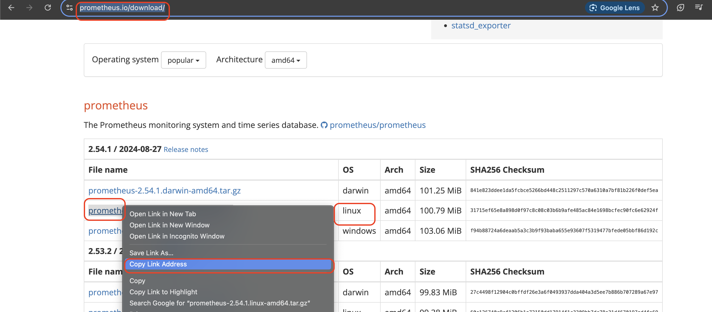

**Step 2**

Run the command "wget <copied link>" in the terminal to download the tar file.

`wget https://github.com/prometheus/prometheus/releases/download/v2.54.1/prometheus-2.54.1.linux-amd64.tar.gz`

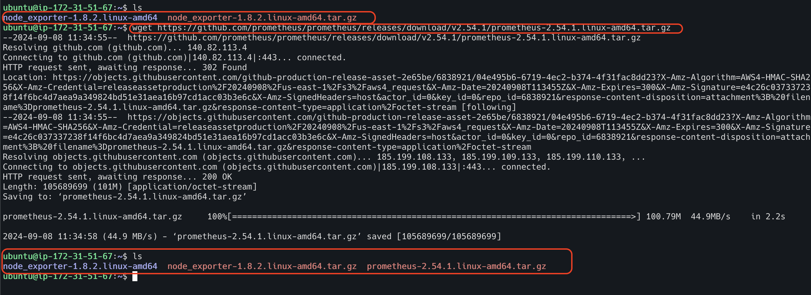

**Step 3**

Untar the downloaded file using the command "tar -xvzf <filename>.

`tar -xvzf prometheus-2.54.1.linux-amd64.tar.gz`

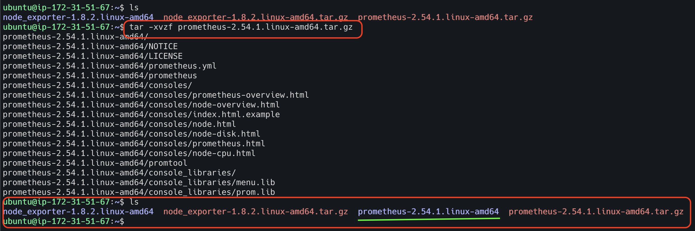

**Step 4**

Navigate to prometheus directory (unzipped one)

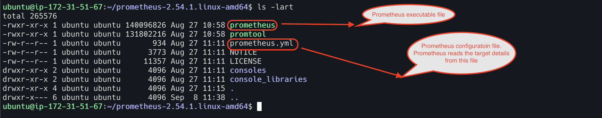

**Step 5**

Start the prometheus executable file (This is nothing but prometheus server)

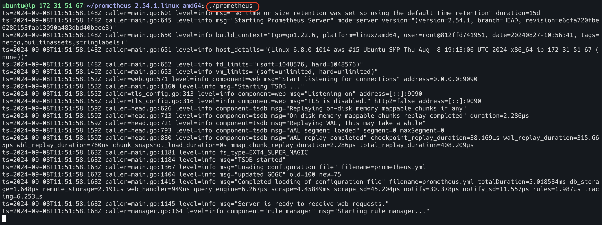

**Step 6**

Open the browser and enter prometheus server IP followed by port number 9090.

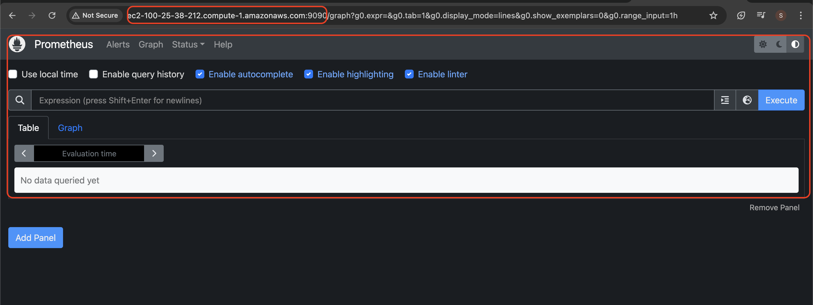

Stopping prometheus server

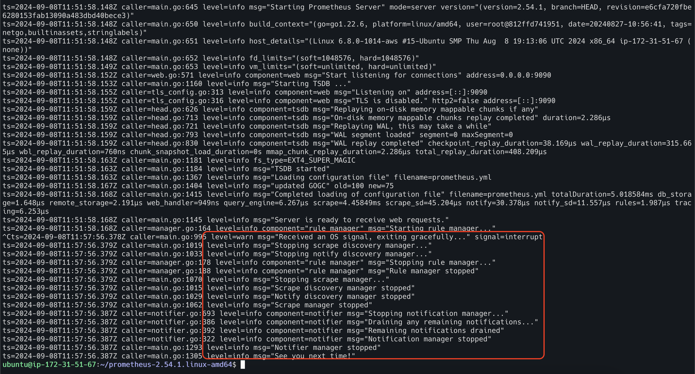

Now prometheus UI is not working.

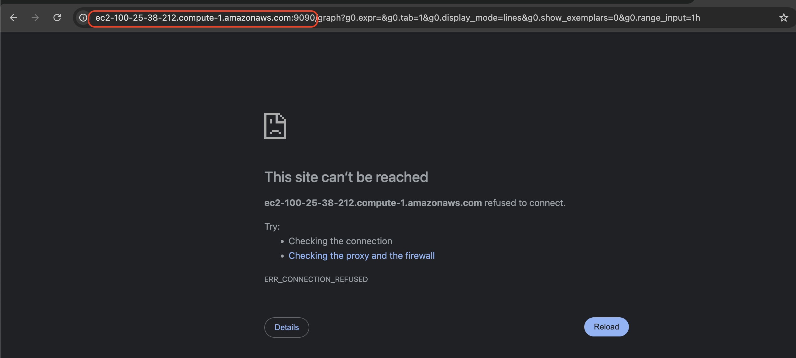

***
Prometheus is up and running now.
However, if I close the terminal where prometheus executable is running or my EC2 instance is down, then the prometheus
also stops. Hence, this is not the ideal way to run the prometheus.
***


**The ideal way of running prometheus is to install and run as a service.** 

To do so, we need to follow below steps

**Step 1 - Update the system packages**

 Run the command 
```html 
sudo apt update
```

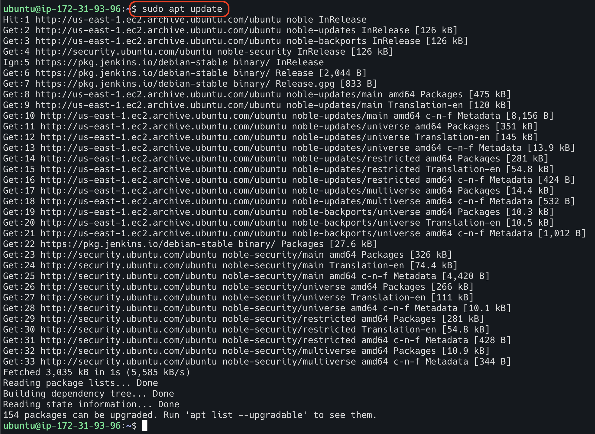

**Step 2 - Create a system user for prometheus**

System username is `prometheus`.
Before doing it, we need to ensure `prometheus` user is not created yet. 

To do so, run the command `cat /etc/passwd | grep -i prometheus`
If it returns value, it means `prometheus` user is already available in the system.

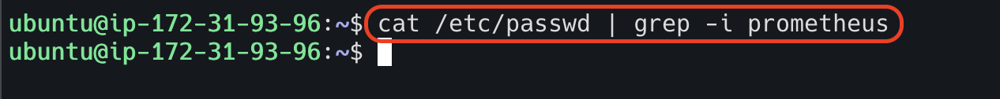

As the above command returns nothing, we can create system user now. To create the user, run the below commands

```html
sudo groupadd --system prometheus
sudo useradd -s /sbin/nologin --system -g prometheus prometheus
```
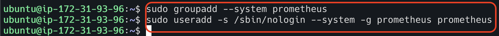


Let us ensure the user `prometheus` is created.

```html
cat /etc/passwd | grep -i prometheus
```

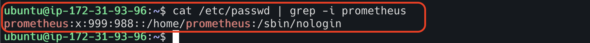


**Step 3 - Create Directories for Prometheus**

To store configuration files and libraries for Prometheus, you need to create a few directories. 
The directories will be located in the `/etc` and the `/var/lib` directory respectively. 
Use the commands below to create the directories:

```html
sudo mkdir /etc/prometheus
sudo mkdir /var/lib/prometheus
```

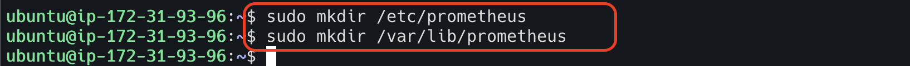

**Step 4 - Move the Binary Files & Set Owner**

Navigate to the prometheus directory. You need to move some binary files (prometheus and promtool) and change the 
ownership of the files to the "prometheus" user and group. You can do this with the following commands:

```html
sudo mv prometheus /usr/local/bin
sudo mv promtool /usr/local/bin

# set the owner 
sudo chown prometheus:prometheus /usr/local/bin/prometheus
sudo chown prometheus:prometheus /usr/local/bin/promtool
```

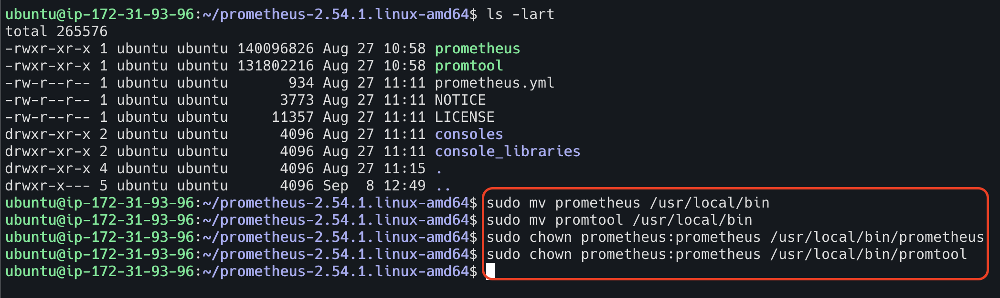


**Step 5 - Move the Configuration Files & Set Owner**

Next, move the configuration files and set their ownership so that Prometheus can access them. 
To do this, run the following commands:

```html
sudo mv consoles /etc/prometheus
sudo mv console_libraries /etc/prometheus
sudo mv prometheus.yml /etc/prometheus

# set the owner 
sudo chown prometheus:prometheus /etc/prometheus
sudo chown -R prometheus:prometheus /etc/prometheus/consoles
sudo chown -R prometheus:prometheus /etc/prometheus/console_libraries
sudo chown -R prometheus:prometheus /var/lib/prometheus
```

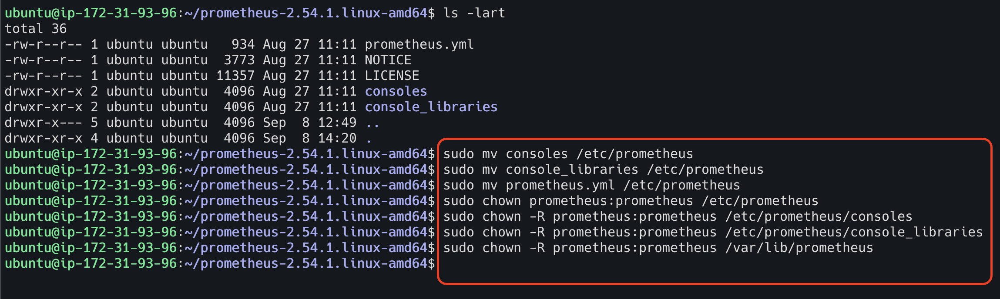

The `prometheus.yml` file (/etc/prometheus/prometheus.yml) is the main Prometheus configuration file. 
It includes settings for targets to be monitored, data scraping frequency, data processing, and storage.


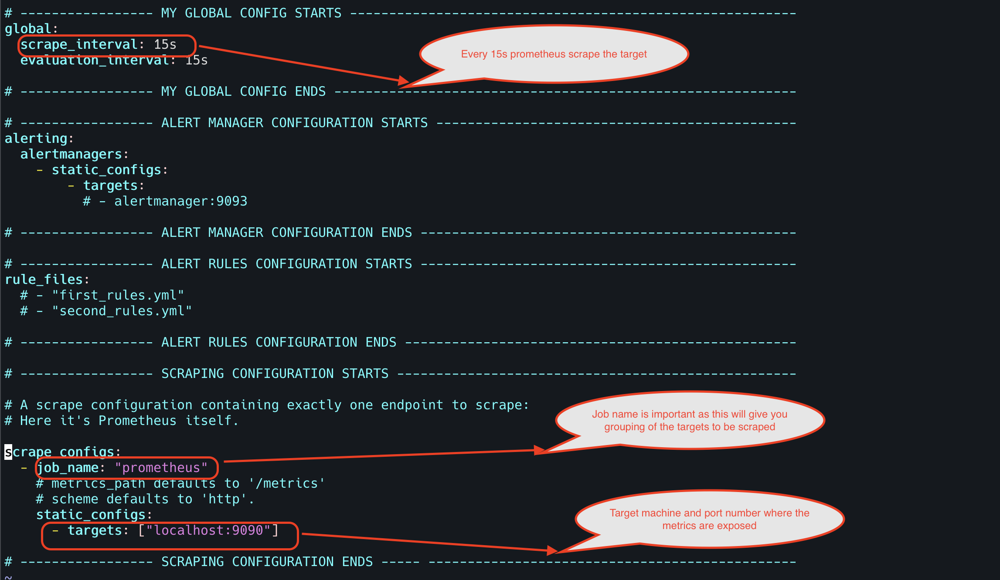


**Step 6 - Create Prometheus Systemd Service**

Now, you need to create a system service file for Prometheus. 
Create and open a prometheus.service file with the vi text editor using:

```html
vi /etc/systemd/system/prometheus.service
```
Content of the file is

```html
[Unit]
Description=Prometheus
Wants=network-online.target
After=network-online.target

[Service]
User=prometheus
Group=prometheus
Type=simple
ExecStart=/usr/local/bin/prometheus \
    --config.file /etc/prometheus/prometheus.yml \
    --storage.tsdb.path /var/lib/prometheus/ \
    --web.console.templates=/etc/prometheus/consoles \
    --web.console.libraries=/etc/prometheus/console_libraries

[Install]
WantedBy=multi-user.target
```

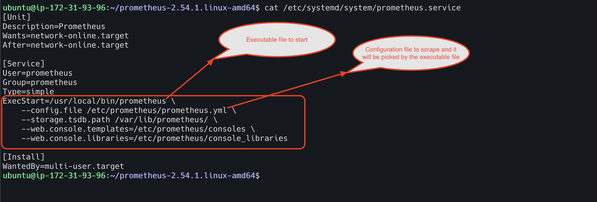

**Step 7 - Reload Systemd**

You need to reload the system configuration files after saving the prometheus.service file so that changes made 
are recognized by the system. Reload the system configuration files using the following:

```html
sudo systemctl daemon-reload
```

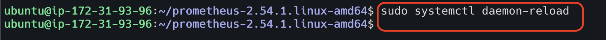

**Step 8 - Start Prometheus Service**

Next, you want to enable and start your Prometheus service. Do this using the following commands:

```html
sudo systemctl enable prometheus
sudo systemctl start prometheus
```

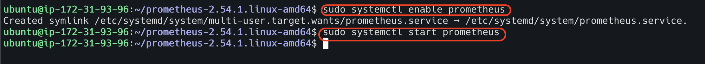


**Step 9 - Check Prometheus Status**

After starting the Prometheus service, you may confirm that it is running or if you have encountered errors using:

```html
sudo systemctl status prometheus
```

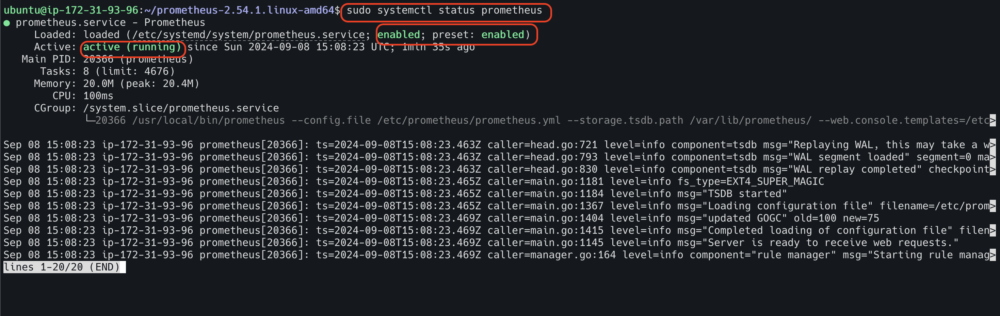

**Step 10 - Update firewall rules**
Prometheus runs on port 9090 by default, so you need to allow port 9090 on your firewall, Do that using the command:

```html
sudo ufw allow 9090/tcp
```

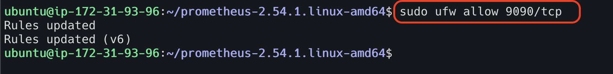

With Prometheus running successfully, you can access it via your web browser using <ip_address>:9090

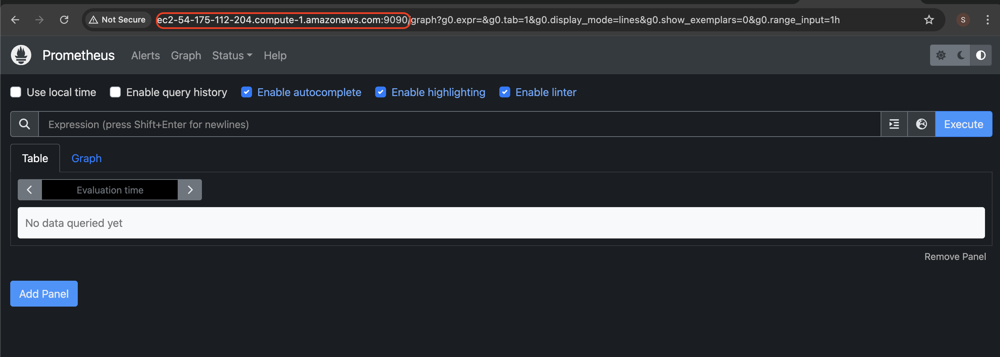

Run the query in prometheus UI.

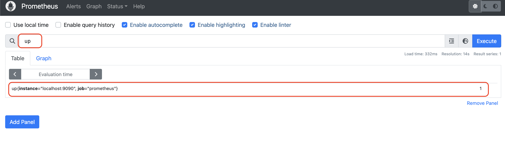