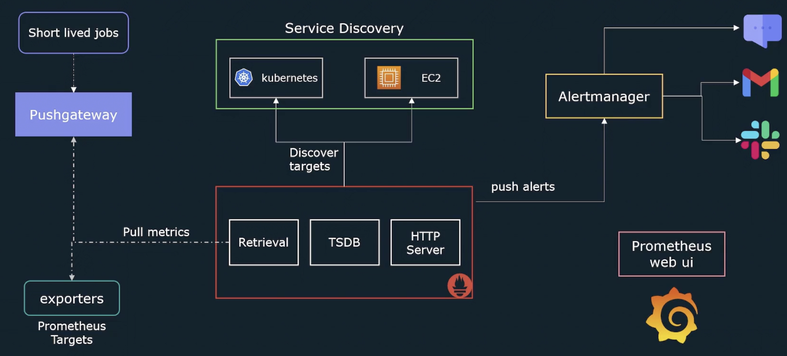

# Introduction to Prometheus

<mark>Prometheus is an open-source monitoring tool that helps to collect the metrics data and visualize them. 
It allows us to trigger an alert when the metric exceeded the threshold value.
</mark>

Prometheus collects the metrics from scraping the target machines (which need to be monitored).
Target machines are exposing their metrics to an HTTP endpoint, 
and Prometheus scrapes them by sending GET request to that endpoint. 

All scraped metrics are stored in a time-series database and can be queried by prometheus using promql. 

Prometheus is written in `Go` language.
<mark>It is primarily designed to monitor for numerical data and NOT designed for system logs, events, etc.</mark>

## Architecture

In prometheus server, there are three main parts involved.

1. Retrieval
2. Time-series database
3. HTTP server

Retrieval is usually collecting the metrics from the target machines
by initiating GET request to the endpoint where the target machine exposes the metrics.

Once the metrics are gathered, it will be stored in a time-series database.

HTTP server allows us to read the metrics stored in a time-series database. User will make an HTTP request to HTTP server 
using PromQL. Then HTTP server retrieves the data from time-series for the user request. 

**Exporters**

In prometheus architecture, exporters are crucial.
<mark>Exporters are nothing but a process running in a target machine.
It collects the metrics data from the target machine and converts them to the format that prometheus can understand.
Then exporters expose the metrics to an HTTP endpoint.</mark> Retrieval components will make a call to this endpoint and scrape 
the metrics (pull the metrics) for this target machine.

**Short-lived Jobs & Push Gateway**

Assume that we need to monitor some job that lives short
(let's say 5 seconds), and our scraping interval in the prometheus server configured as 15 seconds.
By the time the scraping starts, the job must have terminated, and we lose the metrics for that job. 

To avoid losing the jobs metric, there is another component named `push gateway` involved.
<mark>Short-lived jobs push the metric to push gateway,
and prometheus server will scrape the metrics from push gateway.</mark>

**Service Discovery**

In general, prometheus expects all the target details to be configured in the configuration file.
However, these are static details such as IP address, and port.
<mark>In the case of dynamic environment like kubernetes, AWS EC2 instances, the target details will be dynamic.
To handle this situation, Service discovery is in place. It provides the list of targets to be scraped to prometheus server.
</mark>

**Alert Manager**

Prometheus never sends an email or sms to the users. It is a responsibility of alert manager.
<mark>Prometheus trigger the alerts and push them to alert manager when the metric is exceeded the threshold value.
These threshold values are configured in alerting rules. Once alerts are reached to alert manager, alert manager starts
sending an alert to the respective person via email or sms based on the configuration created for alerting.</mark>

**Visualise**

Using PromQL, grafana/prometheus UI will query the data and visualize them in the graphical format.
They will make a query to HTTP server and read the metric.

Remember
***
- Prometheus will scrape the metrics from `/metric` endpoint by default.
  In case your application exposes the metric in a different endpoint,
  you have to configure it in the prometheus configuration file.
- By default, most of the servers will not collect the metrics and expose them to an endpoint.
  That's why we install exporters in those servers and gather the metrics.
***

**Client Libraries**

If we want to gather application metrics, prometheus allows us to install the client libraries
and expose application metrics that can be scraped by prometheus server.
Client libraries support the following languages
- Go
- Python
- Java
- Ruby
- Rust

## Pull-Based Model

<mark>Prometheus follows pull-based model.</mark> It means that it has the list of the servers (targets) to be scraped. 
Prometheus pulls the metrics from these target machines and target machines never send any data to the prometheus server.

Example:

1. Prometheus
2. Nagios

## Push-Based Model
The target machines send the data to the server. Server will collect them and aggregate them and do what it wants to. 

Example:

1. Logstash
2. Open TSDB

Remember
***
- In pull-based model, it is easy to tell if the server is up or down as the server maintains the list of the targets.
- In push-based model, it is not easy to tell if the server is down or decommissioned as servers don't have any list of the targets
***

