# Introduction to PromQL (Prometheus Query Language)

PromQL is used to get the metrics in Prometheus.
When you run the promql expression, we can get any of the below four types of metric.

1. String (currently unused. `Example: "some string"`)
2. Scalar (floating point numeric value. `Example: 124.28`)
3. Instant vector - It is a set of time-series contains a single sample for each time-series. All sharing the same timestamp.
   
`Example:`

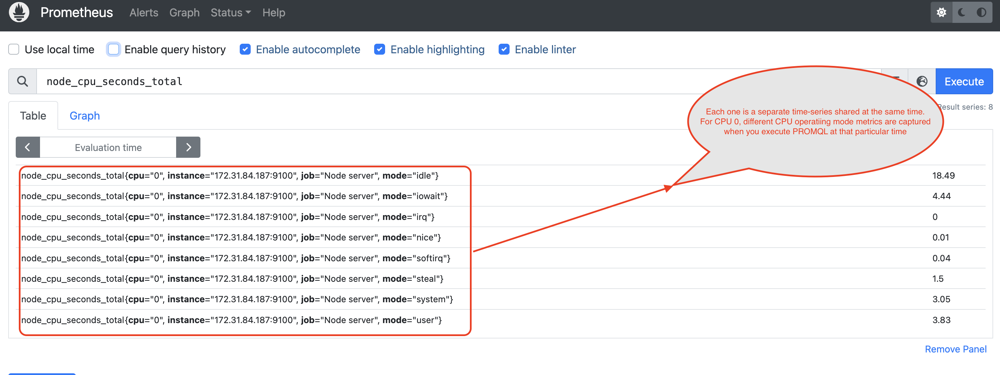    

4. Range vector - It is a set of time-series contains a range of data points over time for each time-series.

`Example:`

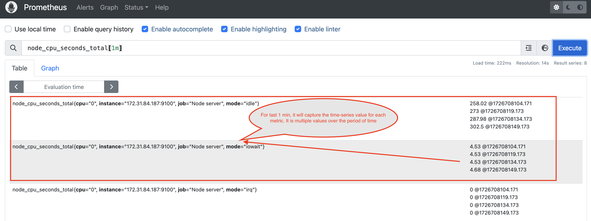    

## Selectors

Selectors are nothing but a filter. It helps to filter the metric for specific parameter.

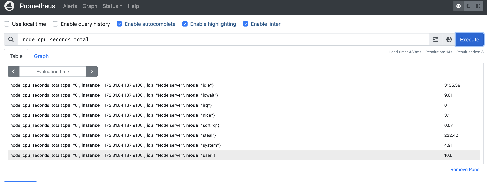   

In the above snapshot, we want to capture the metric for `steal` mode, then we need to use `mode=steal` selector.

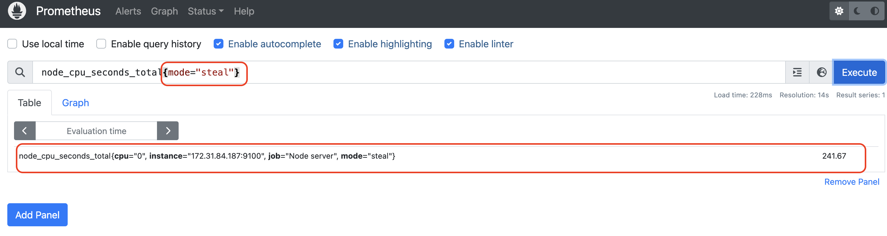  

## Multiple Selectors

Multiple selectors are nothing but a filter with multiple labels. It helps to filter the metric for specific parameter.

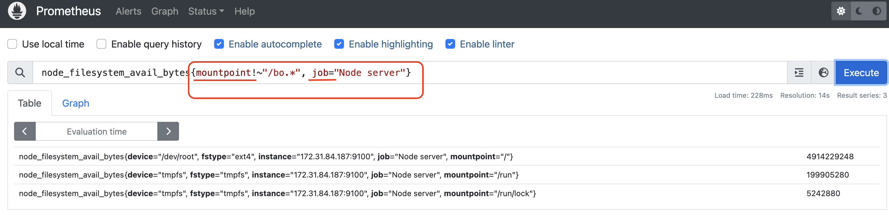 


## Range Vector Selectors

Range vector selectors are nothing but a filter over the period of time.

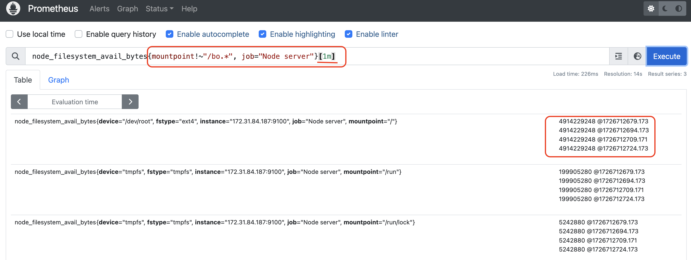 

## Matchers

There are four types of matcher.

1. Equality
2. Negative Equality
3. Regular Expression Matcher
4. Negative Regular Expression Matcher

**Equality Matcher**

It checks the label/selector should be equal to the exact value.
In the below case, mode is the selector, and it should exactly match `steal`.
Then the metric can be fetched. 

  

**Negative Equality Matcher**

It checks the label/selector should not be equal to the exact value.
In the below case, mode is the selector, and except `steal` value, it can bring all other mode metrics.
Then the metric can be fetched. 

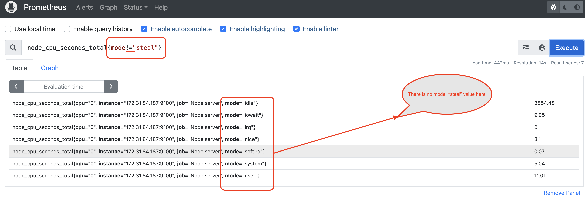  

**Regular Expression Matcher**

It checks the label/selector should equal to the approximate value with the pattern mentioned in the label.

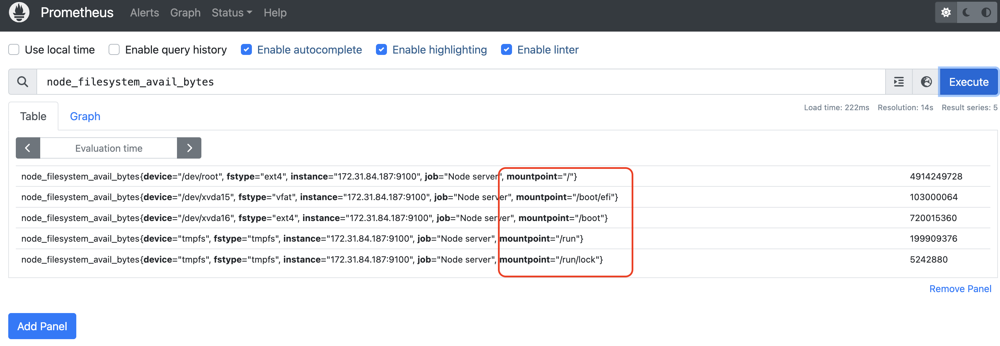  

In the above case, mountpoint has multiple values.
Now if we want to filter all the metrics for the mountpoint starts with `/bo` word.

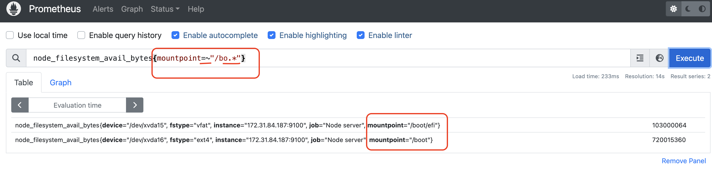  


**Negative Regular Expression Matcher**

It checks the label/selector should not be equal to the approximate value with the pattern mentioned in the label.

  

In the above case, mountpoint has multiple values.
Now if we do not want to filter all the metrics for the mountpoint starts with `/bo` word.

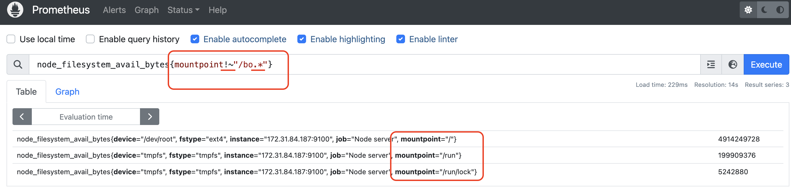 

If we want to filter two values, we can use `|` in the regular expression selector.

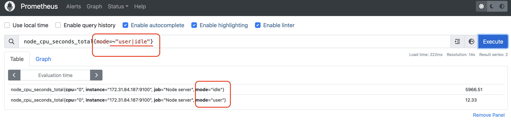 

## Offset

If you want to check the historic data, you can use offset.

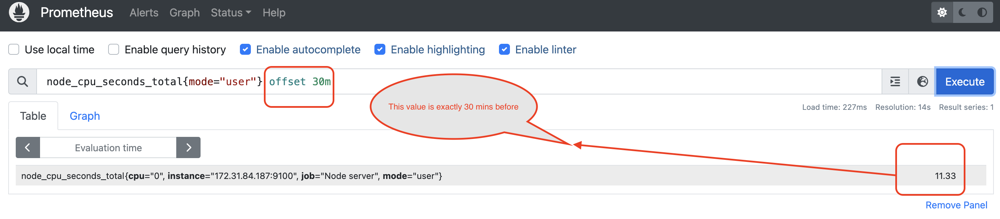 

In the above snapshot, the value is displayed that occurred exactly 30 minutes ago from now.


## Modifier

If you want to check the historic data for a specific time, you can use modifier.
For example, I want to see the metric on Thursday, 19 September 2024 06:58:24.
I need to convert the date to epoch time and use it in modifier like below

Thursday, 19 September 2024 06:58:24 = Epoch time is 1726709304

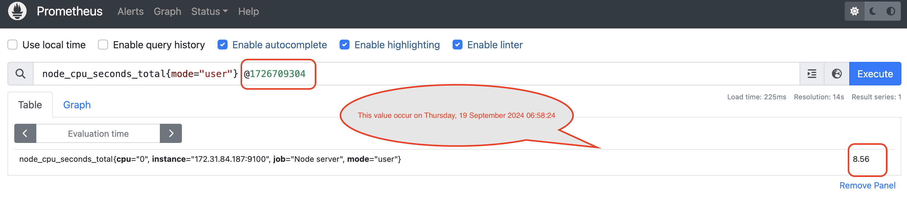 

`We can use both offset and modifier in the same promql expression.`

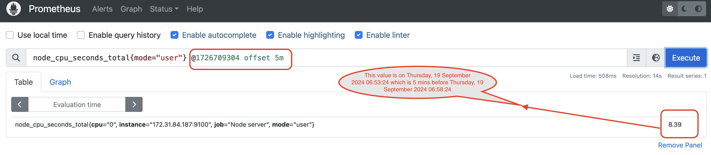 


Remember that 

```html
node_cpu_seconds_total{mode="user"} @1726709304 offset 5m = node_cpu_seconds_total{mode="user"} offset 5m @1726709304 
```
`node_cpu_seconds_total{mode="user"}[1m] @1726709304 offset 5m` we can use offset and modifier in range vector as well.

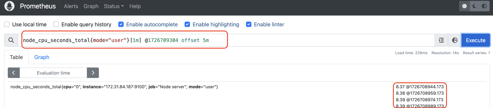 

