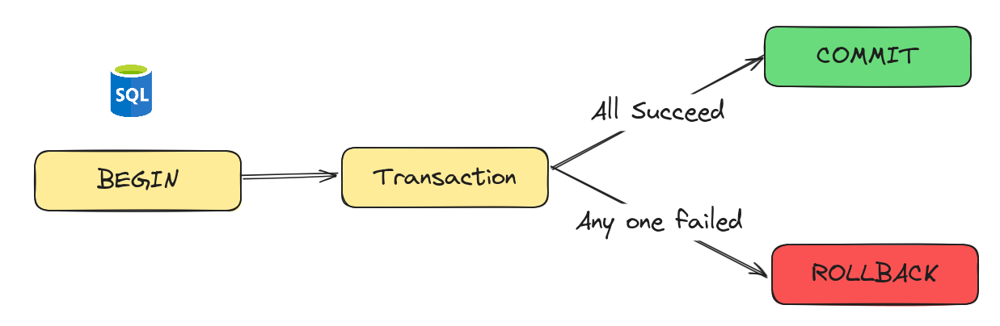
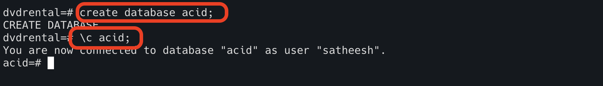
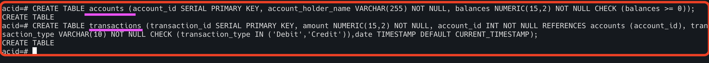
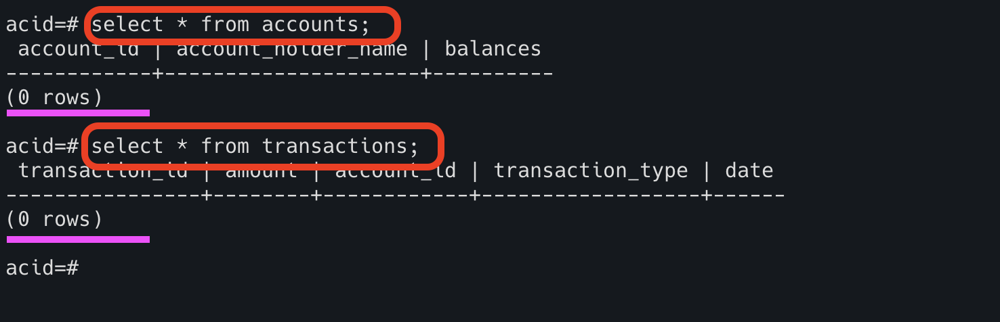
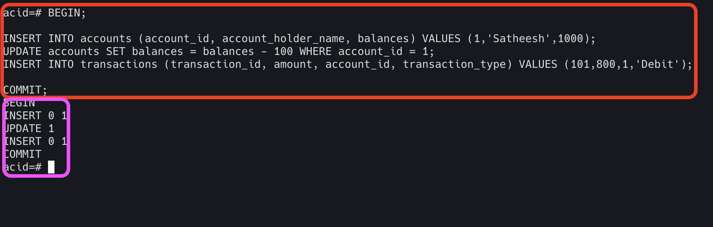
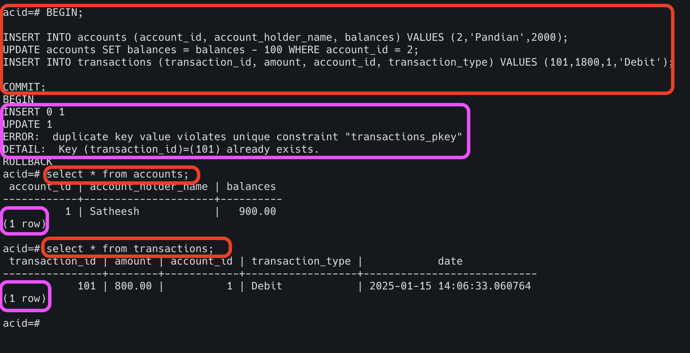
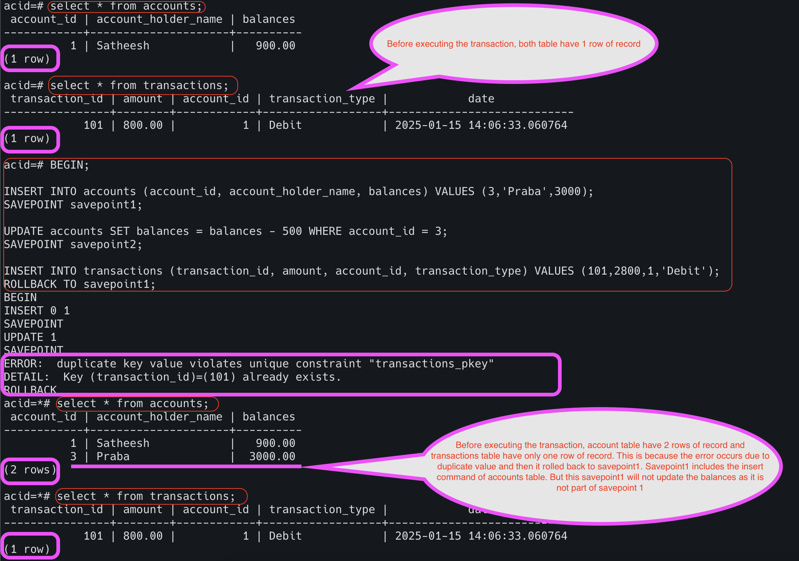

# ACID (Atomicity, Consistency, Isolation and Durability)

A transaction is a single unit of work that interacts with the database
and modifying the database through read or write operations.
To maintain the database consistency before and after the transaction, it must be followed by ACID properties.


## Atomicity in ACID

Atomicity treats the transaction is a single unit
and all operations defined in the transaction executed together as a single unit.
It ensures that either all the operations are successfully executed or none of them executed successfully.
It is even called as "All or Nothing" rule.



Atomicity means if any part of the transaction is failed due to some reason,
it ensures that entire transactions are rolled back to the previous state before transactions start.

In Postgres, atomicity can be done in below ways.

1. WAL (Write Ahead Logging) - It maintains the transaction log and ensures the changes can be done or undone. 
2. Transactional Control Commands - Commands can be set to the transactions as boundaries and control the outcome.

Let's do the example.

1. Create the database and switch to it.



2. Create the required tables (accounts and transactions).

```html
CREATE TABLE accounts (
account_id SERIAL PRIMARY KEY, 
account_holder_name VARCHAR(255) NOT NULL, 
balances NUMERIC(15,2) NOT NULL CHECK (balances >= 0)
);

CREATE TABLE transactions (
transaction_id SERIAL PRIMARY KEY, 
amount NUMERIC(15,2) NOT NULL, 
account_id INT NOT NULL REFERENCES accounts (account_id), 
transaction_type VARCHAR(10) NOT NULL CHECK (transaction_type IN ('Debit','Credit')),
date TIMESTAMP DEFAULT CURRENT_TIMESTAMP
);
```





3. Let's do the successful transaction using a TCC option.

```html
BEGIN;

INSERT INTO accounts (account_id, account_holder_name, balances) VALUES (1,'Satheesh',1000);
UPDATE accounts SET balances = balances - 100 WHERE account_id = 1;
INSERT INTO transactions (transaction_id, amount, account_id, transaction_type) VALUES (101,800,1,'Debit');

COMMIT;
```


In the above example, all the operations (insert, update and insert) are successfully executed. 

4. Let's do the failure transaction using a TCC option.

```html
BEGIN;

INSERT INTO accounts (account_id, account_holder_name, balances) VALUES (2,'Pandian',2000);
UPDATE accounts SET balances = balances - 100 WHERE account_id = 2;
INSERT INTO transactions (transaction_id, amount, account_id, transaction_type) VALUES (101,1800,1,'Debit');

COMMIT;
```



In the above example, the first two operations (insert and update) are successfully executed,
but the third operation (insert) is failed due to duplicate key value.
Hence, all the operations are not successful and restored the database to previous stage.

### Atomicity with savepoint

Savepoint is similar to snapshot and the operations stored in it.
Based on the failure, we can make partial operations to be successful using this savepoint.

```html
BEGIN;

INSERT INTO accounts (account_id, account_holder_name, balances) VALUES (3,'Praba',3000);
SAVEPOINT savepoint1;

UPDATE accounts SET balances = balances - 500 WHERE account_id = 3;
SAVEPOINT savepoint2;

INSERT INTO transactions (transaction_id, amount, account_id, transaction_type) VALUES (101,2800,1,'Debit');
ROLLBACK TO savepoint1;
```



In the above example,
savepoint 1 is included the insert command and savepoint 2 is included both insert and update commands.
When the failure occurs,
 we are instructed
to roll back up to savepoint 1. This means we are good to go for inserting the record in the accounts table,
but not ready to update the balance value. 

## Consistency in ACID

