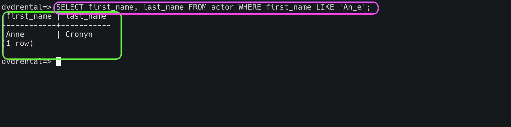
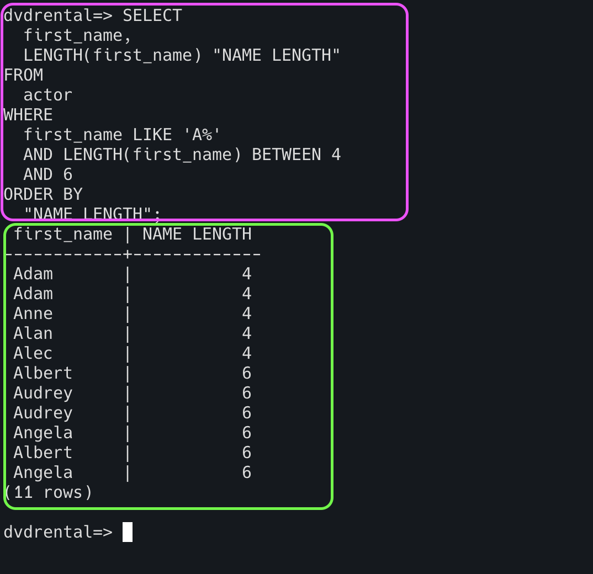

# Filtering Data

To filter the data from the table, we will use `WHERE` condition. This condition will evaluate and return true or false.
The query returns only rows that satisfy the condition in the WHERE clause.

```html
SELECT <column name> FROM <table name> WHERE <condition>
```

```html
SELECT first_name FROM actor WHERE first_name='Tim';
```


**If you are using the column aliases, you can't use them in the query.**

```html
SELECT first_name AS "First name" FROM actor WHERE 'First name'='Tim'; -> This will throw an error.
```

To form the condition in the WHERE clause, you use comparison and logical operators

| **Operator** | **Description**                                                       |
|--------------|-----------------------------------------------------------------------|
| =            | Equal                                                                 |
| >            | Greater than                                                          |
| <            | Less than                                                             |
| >=           | Greater than or equal                                                 |
| <=           | Less than or equal                                                    |
| <> or !=     | Not equal                                                             |
| AND          | Logical operator AND                                                  |
| OR           | Logical operator OR                                                   |
| IN           | Return true if a value matches any value in a list                    |
| BETWEEN      | Return true if a value is between a range of values (range inclusive) |
| LIKE         | Return true if a value matches a pattern                              |
| IS NULL      | Return true if a value is NULL                                        |
| NOT          | Negate the result of other operators                                  |


## WHERE clause with the equal (=) operator

```html
SELECT first_name FROM actor WHERE first_name='Tim';
```


## WHERE clause with the AND operator 

```html
SELECT first_name FROM actor WHERE first_name='Tim' AND last_name='Hackman';
```


## WHERE clause with the OR operator

```html
SELECT first_name, last_name FROM actor WHERE first_name='Tim' OR last_name='Hackman';
```


## WHERE clause with the IN operator

`Remember that when the column involves date with timestamp, you have to give column::date in the filter condition`

```html
SELECT first_name, last_name FROM actor WHERE first_name in ('Dan','Bob','Sandra','Elvis');

Same query can be written like below 

SELECT first_name, last_name FROM actor WHERE first_name='Dan' OR first_name='Bob' OR first_name='Sandra' OR first_name='Elvis';
```


## WHERE clause with the LIKE operator

```html
SELECT first_name, last_name FROM actor WHERE first_name LIKE 'An%';
```

`%` will match zero or more characters.


```html
SELECT first_name, last_name FROM actor WHERE first_name LIKE 'An_e';
```
`_` will match only one character.




## WHERE clause with the BETWEEN operator 

BETWEEN includes the range boundary as well. It means that between 3 and 5 includes 3 and 5 value too.

```html
SELECT
  first_name,
  LENGTH(first_name) "NAME LENGTH"
FROM
  actor
WHERE
  first_name LIKE 'A%'
  AND LENGTH(first_name) BETWEEN 4
  AND 6
ORDER BY
  "NAME LENGTH";
```



## WHERE clause with the not equal operator

```html
SELECT
  first_name,
  last_name
FROM
  actor
WHERE
  first_name LIKE 'Ang%'
  AND last_name <> 'Hudson';
```


## PostgresSQL AND operator

| **First Condition** | **Second Condition** | **Result** |
|---------------------|----------------------|------------|
| true                | true                 | true       |
| true                | false                | false      |
| true                | null                 | null       |
| false               | false                | false      |
| false               | true                 | false      |
| false               | null                 | false      |


## Postgres OR Operator

| **First Condition** | **Second Condition** | **Result** |
|---------------------|----------------------|------------|
| true                | true                 | true       |
| true                | false                | true       |
| true                | null                 | true       |
| false               | false                | false      |
| false               | true                 | true       |
| false               | null                 | null       |


## LIMIT

`LIMIT` will filter the number of rows to be displayed from the results returned by query. It is an optional clause.

```html
SELECT <column name>
FROM <table name>
ORDER BY <sort expression>
LIMIT <row count>;
```

```html
SELECT first_name, last_name FROM actor LIMIT 5;
```


## OFFSET

`OFFSET` will skip the number of rows returned from the results returned by query. It is an optional clause.

```html
SELECT <column name>
FROM <table name>
ORDER BY <sort expression>
LIMIT <row count>
OFFSET <row count to be skipped>;
```

```html
SELECT actor_id, first_name, last_name FROM actor LIMIT 5 OFFSET 5;
```


**Order of execution in the above query is below**

1. Query execution
2. Offset implementation
3. Limit the result after offset implementation


## LIMIT OFFSET to get top/bottom N rows

**TOP rows**

```html
SELECT actor_id, first_name, last_name FROM actor ORDER BY actor_id LIMIT 7 OFFSET 3;
```


**BOTTOM rows**

```html
SELECT actor_id, first_name, last_name FROM actor ORDER BY actor_id DESC LIMIT 7 OFFSET 3;
```


## FETCH

This is similar to `LIMIT`.

```html
SELECT <column name>
FROM <table name>
ORDER BY <sort expression>
OFFSET <row to skip> { ROW | ROWS }
FETCH { FIRST | NEXT } [ row_count ] { ROW | ROWS } ONLY
```

```html
SELECT actor_id, first_name, last_name FROM actor OFFSET 5 FETCH NEXT 3 ROWS ONLY;

or 

SELECT actor_id, first_name, last_name FROM actor OFFSET 5 FETCH FIRST 3 ROWS ONLY;
```


## PostgresSQL IN operator with a list of dates

```html
SELECT first_name, last_name FROM actor WHERE first_name IN ('Tim', 'Anne');
```


## BETWEEN

```html
SELECT rental_date FROM rental WHERE rental_date::date BETWEEN '2005-05-25' AND '2005-05-26' LIMIT 5;
```


## PostgresSQL LIKE operator

Suppose that you want to find customers, but you don’t remember their names exactly. 
However, you can recall that their names begin with something like `Jen`.

You can use the PostgresSQL LIKE operator to match the first names of customers with a string using the following query.

```html
SELECT
  first_name,
  last_name
FROM
  customer
WHERE
  first_name LIKE 'Jen%';
```


## PostgresSQL ILIKE operator

`ILIKE` is similar to `LIKE`, but it is case-insensitive. 

```html
SELECT
  first_name,
  last_name
FROM
  customer
WHERE
  first_name ILIKE 'jEn%';
```


| **Operator** | **Equivalent** |
|--------------|----------------|
| ~~           | LIKE           |
| ~~*          | ILIKE          |
| !~~          | NOT LIKE       |
| !~~*         | NOT ILIKE      |


## SIMILAR TO

`SIMILAR TO` operator in PostgresSQL offers a way to search for patterns that follow regular expression rules.
The `SIMILAR TO` operator allows you to match a pattern to a string using regular expression syntax

```html
value SIMILAR TO pattern    
```
Where:

`value` is the string or column to be matched.

`pattern` is the regular expression pattern that you want to compare against.


## Basic SIMILAR TO

Below query fetches the first name starts with 'J'
and followed by any one of the characters mentioned within the bracket and followed by 'n' and any characters.

```html
SELECT first_name, last_name
FROM customer
WHERE first_name SIMILAR TO 'J(e|o|a|u|i)n%';
```


## SIMILAR TO with Multiple Patterns

Below query fetches the first name starts with either "J" or "M" and followed by any 3 characters.

```html
select first_name from actor where first_name SIMILAR TO '[JM]___' LIMIT 5
```


## SIMILAR TO with Wildcards

Below, a query fetches the first name contains 'l'. Prefix and suffix of 'l' can be anything.

```html
select first_name from actor where first_name SIMILAR TO '%l%' LIMIT 7;
```


## ESCAPE

`ESCAPE` clause in SQL is used to define an escape character in a query. 
This allows you to escape special characters (like %, _, ', and others) that are typically used for pattern matching or 
other special functions.

### Single Quote (')

```html
select title from test where title SIMILAR TO '%''%';
```


### Percent Sign (%)

If you want to match a literal %, you need to escape it.

```html
select * from test where title like '%$%%' escape '$';
```


### Underscore(_)

To use an underscore literally (i.e., if you’re searching for an actual underscore in your data), you need to escape it.

```html
select first_name from actor where first_name LIKE '!T_%' escape '!';
```


| Character            | Escape Required   | Example                   |
|----------------------|-------------------|---------------------------|
| Single Quote (')     | Yes               | 'It''s a movie'           |
| Percent Sign (%)     | Yes (with ESCAPE) | LIKE '%!%%' ESCAPE '!'    |
| Underscore (_)       | Yes (with ESCAPE) | LIKE '%!_%' ESCAPE '!'    |
| Backslash (\)        | Yes               | 'This is a backslash: \\' |
| Square Brackets ([]) | Yes (with ESCAPE) | LIKE '%[[]%' ESCAPE '!'   |


