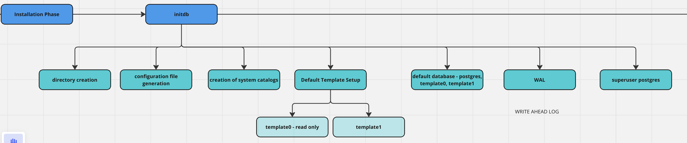
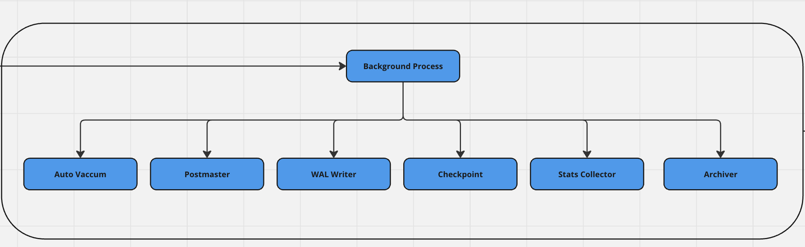

# Introduction to Postgres

Postgres is one of the databases widely used in the market. It is a type of relational database.
Basically it is a collection of records in an organized manner.
There are different types of database models

1. Hierarchy structure database model - Parent child like structure
2. Network database model - It is a web of complexity 
3. Relational database model - Organized as rows and columns in a table

## Data Integrity

There are four different integrities available in the database.

1. Entity integrity - Uniqueness - Primary key ensures it.
2. Referential integrity - Connection between tables/databases - Foreign key ensures it
3. Domain integrity - Each field should follow some rules. For example, age should be a positive number
4. User defined integrity - It depends on the application. For example, voting age should be 18. If not, it cannot update it in the table.


## Installation

As I am using Mac, the installation steps are below

1. Install homebrew

```/bin/bash -c "$(curl -fsSL https://raw.githubusercontent.com/Homebrew/install/HEAD/install.sh)"```

2. Install Postgres

```brew install postgresql```

3. Start the postgres services

```brew service start postgresql```

4. Verify Postgres installation

```brew service list```

5. Access Postgres

```psql postgres```

## Components installed during installation

When you install postgres, there are several processes occur to set up the database in the cluster.

#### 1. Installation Phase

Binary installations such as postgres, psql are installed using the packages like homebrew, yum, apt etc.
Configuration files such as postgresql.conf, pg_hba.conf, pg_ident.conf are configured by default.


#### 2. Initiation Phase

The `initdb` command runs in the initiation phase and prepares the environment for Postgres DB cluster. This will create
the following components.

1. Directory creation

`/var/lib/postgresql/data` directory will create automatically if it does not exist. Subdirectories like `base, global, pg_wal,
pg_stat` also create to organize the datafiles and metadata.

2. Configuration file creation

`postgresql.conf` : This is the main configuration file
`ps_hba.conf` : This is for client authentication
`ps_ident.conf`: This helps to map OS users to DB users

3. Creation of system catalog

Core system catalog such as `pg_class, pg_attribute, pg_database` are created to manage the database objects.
Essential metadata is initialized.

4. Default template setup

There are two default templates (template 0 and template 1). 

| **template 0**                                           | **template 1**                                                                                      |
|----------------------------------------------------------|-----------------------------------------------------------------------------------------------------|
| This is pristine template used to create other databases | This is used to create databases by default. If it is broken, template 0 will be used to restore it |
| You cannot modify template 0 (read only)                 | You can modify as per your need (custom extension, schemas and objects)                             |

5. Default databases

`postgres` : A default database created for DBA
`postgres` : A default user (super user) is created
`template 0 & template 1` : Refer point # 4


6. WAL initialization

This ensures that the data recovery and durability. Writing Ahead Logging (WAL) is set up under `pg_wal`.




## Background processes


Once initialized, postgresql runs many different background processes for DBMS.

1. `postmaster` process: This is the main server process that manages all the sub processes.

2. `WAL writer` process: It handles WAL updates

3. `Checkpoint` process: It helps to write the dirty pages to disk to maintain the data integrity

4. `Autovacuum` process: Automatically manages vacuum and analyse tasks

5. `Stats collector` process: Collects the stats for query optimization

6. `Archiver` process: Archives completed WAL segments when configured




## Role Management

Roles are important in postgres as everything is handled using roles.
Roles own the database objects and grant permission to perform operation like SELECT, UPDATE, DELETE, etc.

Roles can be two types

1. Login role
2. Non login role

If you need to perform any operation in postgres, you need to assign a role. 

`A role with login privilege is called user`. 

```html
CREATE ROLE satheesh WITH LOGIN PASSWORD 'password';
GRANT developers TO satheesh;
```

Now `satheesh` becomes user.

```html
CREATE ROLE pandian ;
GRANT SELECT, INSERT on MY_TABLE TO pandian;
```

`pandian` is a role because it doesn't have a login privilege. This role has a select, insert permission only to my_table.
It cannot access any other table, and also it doesn't do anything other than insert, select on my_table.

### Key Points About Roles

1. [ ] No Login by Default: Roles can only log in if the LOGIN attribute is set.
2. [ ] Inheritance: Roles can inherit permissions from other roles using GRANT. 
3. [ ] Combining Roles: Users can belong to multiple roles, and their permissions will combine.


**Examples for Roles**

**1. Basic Role Without Login**

```html
CREATE ROLE satheesh;
GRANT SELECT, INSERT, UPDATE on EMPLOYEE TO satheesh;
```

**2. Role with Login (User Role)**

```html
CREATE ROLE pandian WITH LOGIN PASSWORD 'password';
GRANT SELECT, INSERT, UPDATE on EMPLOYEE TO pandian;
```

**3. Role with Inheritance**

```html
CREATE ROLE employee;
GRANT SELECT on CUSTOMER TO employee;

CREATE ROLE manager;
GRANT INSERT, UPDATE ON CUSTOMER TO manager;
GRANT employee TO manager;

CREATE ROLE adhira WITH LOGIN PASSWORD 'password';
GRANT manager TO adhira;
```

Now `adhira` can perform SELECT, INSERT,
and UPDATE operations on the CUSTOMER table because she inherits the permission from employee through a manager role.

**4. Temporary Role**

```html
CREATE ROLE consultant WITH LOGIN PASSWORD 'consult123' VALID UNTIL '2025-12-31';
GRANT SELECT ON CUSTOMER TO consultant;
```

