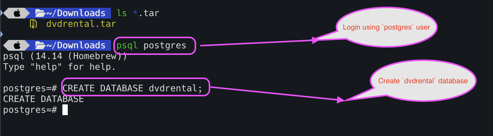
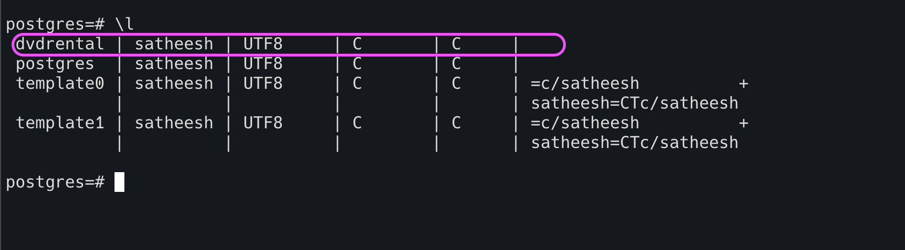
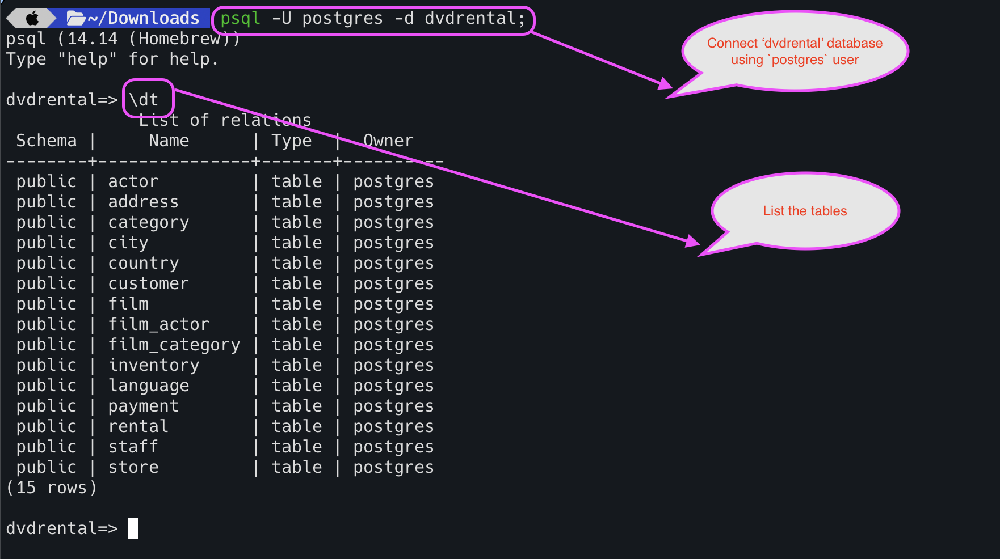
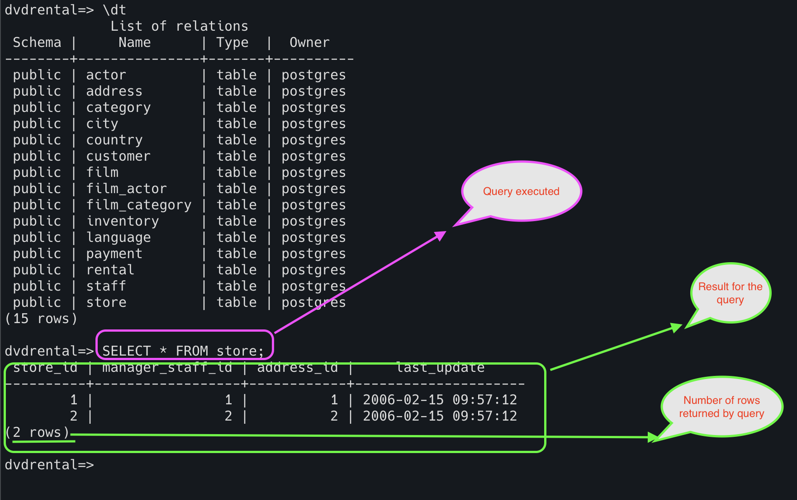
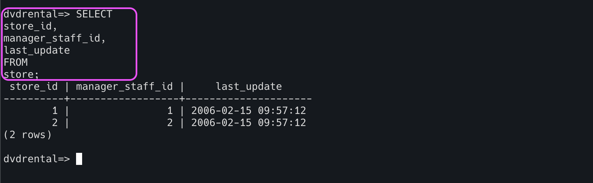
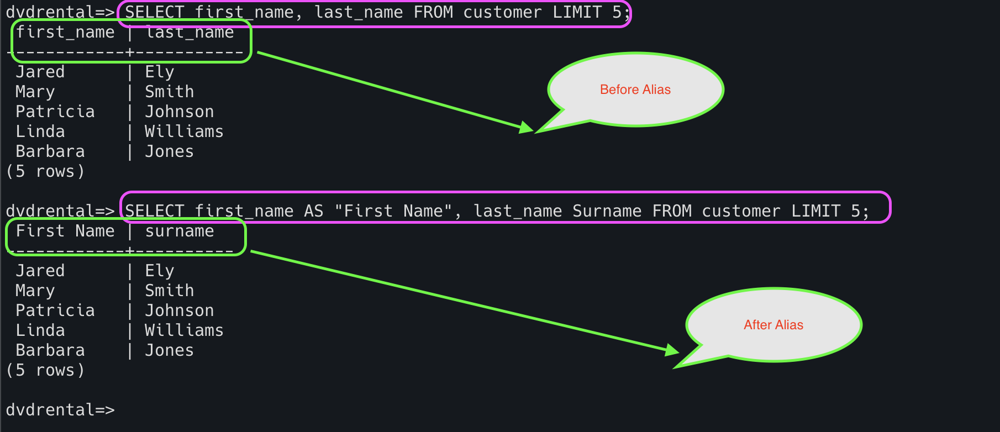
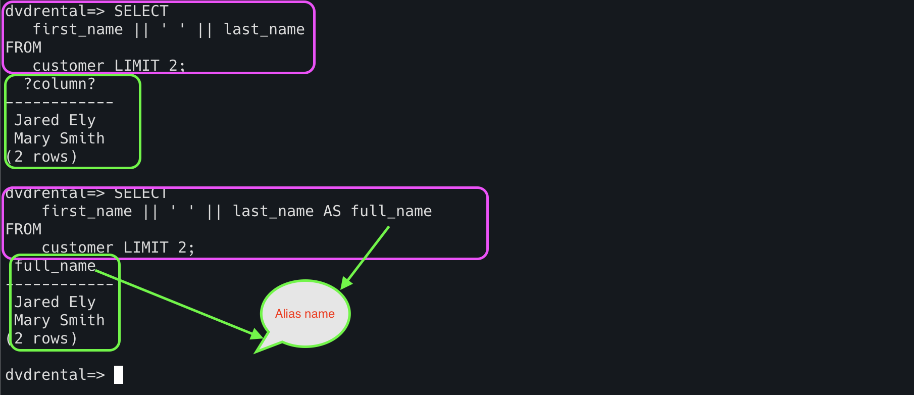
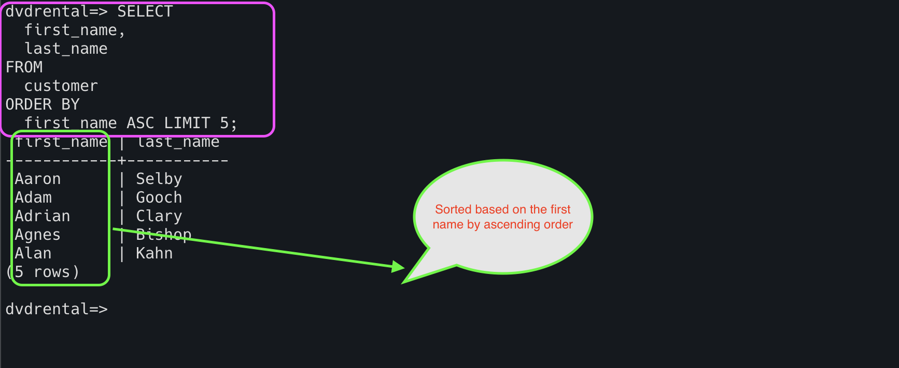
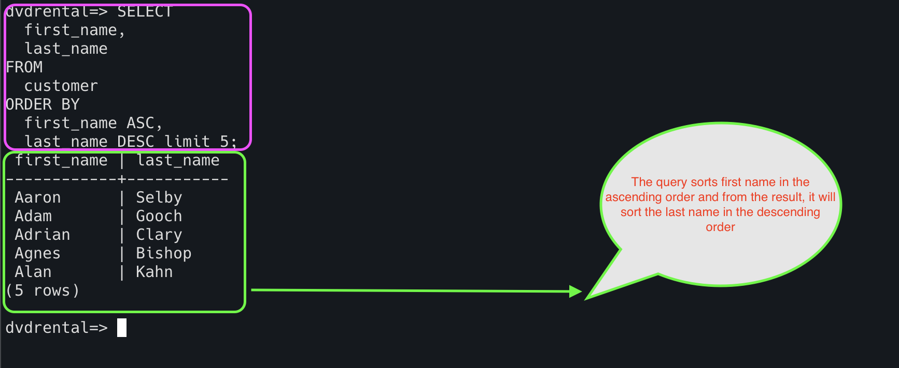
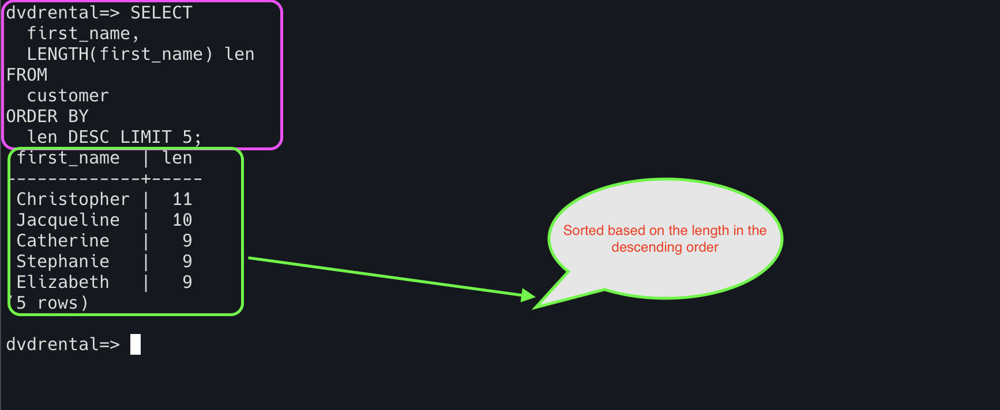

# Querying Data

Before querying the data from the database, we need to create the database in the postgres.


**Source**

Sample data is stored at ` 
https://github.com/syedjaferk/postgres_sample_database/blob/main/dvd_rental/dvdrental.tar` location.

## Steps to import the database

1. Download the tar file from the given link.
2. Login to the postgres db using `psql postgres` and create the database `dvdrental`



3. Verify if the database is created using `\l`



4. Disconnect the postgres using `exit`


5. Load the dataset into the database using `pg_restore`


6. Login to the postgres with the database as dvdrental and verify the database is loaded.




## SELECT Query

The SELECT statement is an SQL command used to retrieve data from the database.

**1. Basic SELECT Statement**

```html
SELECT <column name> FROM <table name>;
```

```html
SELECT 
*
FROM
store;
```


**2. SELECT statement with multiple columns**

```html
SELECT <column name 1, column name 2, ..> FROM <table name>;
```

```html
SELECT 
store_id,
manager_staff_id,
last_update
FROM
store;
```


Remember that we should not use `*` in the select query because it leads to the following issues

**1. Performance issues :** Retrieving all the columns will make database operations slow if the retrieving data is huge.

**2. Application overhead :**
If we are retrieving the data
which is unnecessary for application operation will lead to more traffic/load to the application.

**3. Application break :** If you are using `*` in the query, application may break in case of database structure changed after the application deployed in the production.

So, if we don't know the table structure, we can use `*` to find out the table columns.
Also, if we are troubleshooting, then we can use `*` in the select statement. Other than this, we cannot use `*`
in any other situation. It is not a good practice.

**Example:** Instead of this

```html
SELECT * FROM employees;
```
Do this,
```html
SELECT id, name, department FROM employees;
```

## ALIAS

The main purpose of column aliases is to make the headings of the output more meaningful.
This is temporary during the execution of the query.


```html
SELECT column_name AS alias_name
FROM table_name;

SELECT column_name alias_name
FROM table_name;
```

**1. Assigning alias to a column**

```html
SELECT first_name, last_name FROM customer LIMIT 5;
```

```html
SELECT first_name AS "First Name", last_name Surname FROM customer LIMIT 5;
```




**2. Assigning alias to an expression**


```html
SELECT
   first_name || ' ' || last_name
FROM
   customer LIMIT 5;
```
```html
SELECT
    first_name || ' ' || last_name AS full_name
FROM
    customer LIMIT 5;

```


## Order By

The ORDER BY clause allows you to sort rows returned by a SELECT clause in ascending or descending order based on a sort expression.
The ORDER BY uses ASC (Ascending) by default.

```html
SELECT
  column name
FROM
  table_name
ORDER BY
  sort_expression1 [ASC | DESC],
  sort_expression2 [ASC | DESC];
```

**1. ORDER BY clause to sort rows by one column**

```html
SELECT
  first_name,
  last_name
FROM
  customer
ORDER BY
  first_name ASC LIMIT 5;
```



**2. ORDER BY clause to sort rows by multiple columns**

```html
SELECT
  first_name,
  last_name
FROM
  customer
ORDER BY
  first_name ASC,
  last_name DESC;
```



**3. ORDER BY clause to sort rows by expressions**

```html
SELECT
  first_name,
  LENGTH(first_name) len
FROM
  customer
ORDER BY
  len DESC LIMIT 5;
```




## SELECT DISTINCT

The SELECT DISTINCT removes duplicate rows from a result set.
The SELECT DISTINCT clause can be applied to one or more columns in the select list of the SELECT statement.

```html
SELECT
  DISTINCT column1
FROM
  table_name;
```

**1. SELECT DISTINCT with one column**

```html
SELECT DISTINCT rental_rate FROM film;
```


**2. SELECT DISTINCT on multiple columns**

```html
SELECT DISTINCT rental_rate, amount FROM film;
```

