# Terraform Basics

When we run the `terraform init` command in a directory contains configuration file, 
terraform downloads the plugin and install them for the providers mentioned (AWS/Azure/GCP/Ali) in the configuration file.

Terraform plugins are available in Hashicorp registry (<a href="https://registry.terraform.io/">https://registry.terraform.io/) for all the providers.
There are three different providers.
- Official Providers : Owned and maintained <mark>by Hashicorp</mark>
- Partner Providers : Owned and maintained <mark>by third party company</mark> that has partner provider access with Hashicorp
- Community Providers : Published and maintained <mark>by individual contributors </mark>of Hashicorp community

All plugins are downloaded into `<working directory>/.terraform` directory. When we download the plugins (during <mark>`terraform init`</mark> command), this will tell you
<mark>where the plugins are from.</mark>

`<Hostname>/<Organisation namespace>/<Provider name>`

Whereas,

Hostname is optional. If it is not mentioned, then it is default value (registry.terraform.io)

Organisation namespace is Hashicorp/Partner Provider/Community Provider

Provider name is AWS/Azure/GCP/Local etc.,

**Configuration Directory**

Terraform considers the file with `.tf` extension is configuration file. A single configuration file can have any number of configuration details.
Also, we can have any number of configuration files as well in a directory. There are few other common configuration files created in a directory.

| Filename     | Purpose                        |
|:-------------|:-------------------------------|
| main.tf      | main configuration file        |
| variables.tf | Contains variable declaration  |
| outputs.tf   | Contains output from resources |
| provider.tf  | Contains provider definitions  |


`NOTE: Let us assume that there are two configurations defined in the configuration file. Both have different plugins and one of the plugin is already installed and other one is not yet installed
In that case, if you run terraform plan / terraform apply command will yield an error. This is because whenever we add a resource for a provider that has not been used so far in the configuration directory, 
we have to initialize the directory by running terraform init command.`

**Multiple Providers**

You can create a configuration file which contains multiple providers like below.

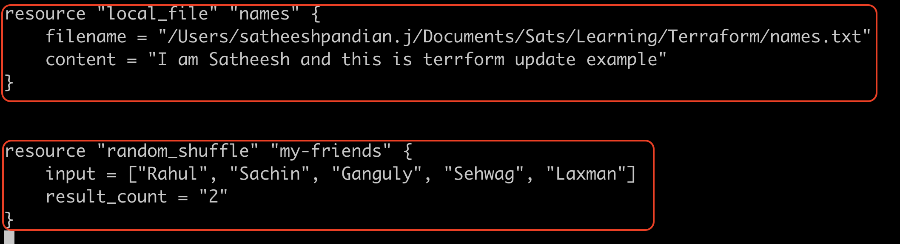

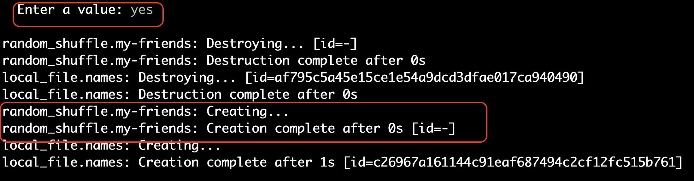


**Input Variables**

For re-usability purpose, we can use variables. To do so, we can create variable.tf file and update all variables in it.
In general, whatever arguments we are passing in block, we can use variable for those arguments.
Remember, both variable configuration file and your main configuration file should be in same directory.


***Syntax***
```
variable <VARIABLE_NAME> {
    default = "<value>"
}
```

***Example***

```main.tf
resource "local_sensitive_file" "games" {
    filename = "/Users/satheeshpandian.j/Documents/Sats/Learning/Terraform/names.txt"
    content = "I am Satheesh and this is terraform update example"
}
```
In the above code snippet, we can use variable for filename and content.

```variable.tf
variable "filename" {
    default = "/Users/satheeshpandian.j/Documents/Sats/Learning/Terraform/names.txt"
}

variable "content" {
    default = "I am Satheesh and this is terraform update example"
}
```

Now, our main configuration file "main.tf" needs to be updated like below

```main.tf
resource "local_sensitive_file" "games" {
    filename = var.filename
    content = var.content
}
```

In case you want to change the content or filename, you just need to update it in variable.tf configuration file.
You DO NOT touch main configuration file at all.

**Variable Types**

In variable block, there are different parameters used.

```variable.tf
variable <VARIABLE_NAME> {
    default = <value>
    type = <ANY/STRING/NUMBER/BOOL/LIST/MAP/OBJECT/TUPLE>
    description = <description of the value>
}
```

Whereas,

type and description are optional. If you don't use `type` parameter, it will consider as `any` by default.
If you use `type` parameter, then it will make sure that default value should have the same type.

***List***

List will be used with its index and index starts from `0` 
```variable.tf
variable "names" {
    default = ["Satheesh", "Pandian", "Jeganathan", "Bangalore", "Karnataka"]
    type = list
    description = "List of names"
}
```

```main.tf
resource "random_pet" "players" {
    firstname = var.names[1]
}
```

We can enforce the list values using STRING/NUMBER/BOOL.

```variable.tf
variable "names" {
    default = ["Satheesh", "Pandian", "Jeganathan", "Bangalore", "Karnataka"]
    type = list(string)
    description = "List of names"
}
```
This will ensure that all the default values should be `string`. It will throw an error if you pass the number or boolean value.


```variable.tf
variable "names" {
    default = [5, 7, 8, 10, 23]
    type = list(number)
    description = "List of numbers"
}
```

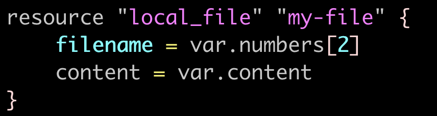

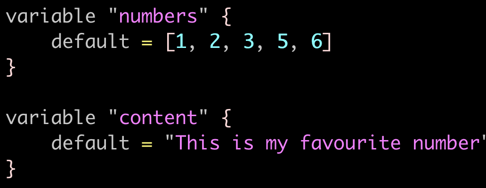

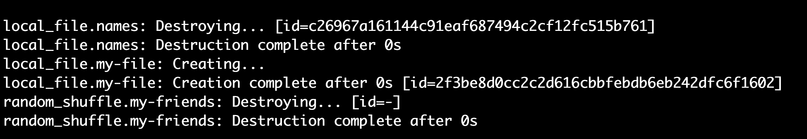

This will ensure that all the default values should be `number`. It will throw an error if you pass the string or boolean value.

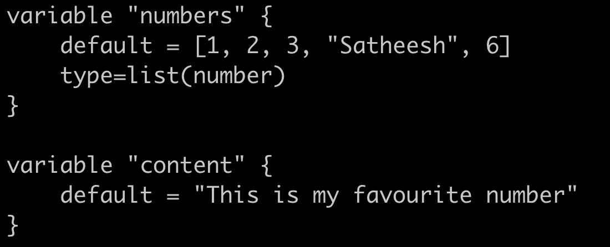

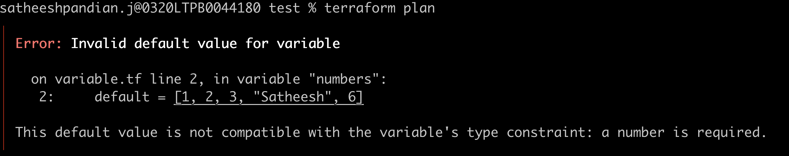

***Map***

Map will be in key/value format. 

```variable.tf
variable "names" {
    default = {
        "firstname" = "Satheesh"
        "lastname" = "Pandian"
    }
    type = map
    description = "map of names"
}
```

```main.tf
resource "random_pet" "players" {
    lastname = var.names["lastname"]
}
```

We can enforce the map values using STRING/NUMBER/BOOL.

```variable.tf
variable "names" {
        default = {
        "firstname" = "Satheesh"
        "lastname" = "Pandian"
    }
    type = map(string)
    description = "Map of names"
}
```
This will ensure that all the default values should be `string`. It will throw an error if you pass the number or boolean value.


```variable.tf
variable "names" {
        default = {
        "favourite" = 5
        "birthdate" = 10
        "anniversary" = 23
    }
    type = map(number)
    description = "Map of numbers"
}
```

***Sets***

This is similar to list except that list can have duplicate elements whereas sets won't allow duplicate elements.

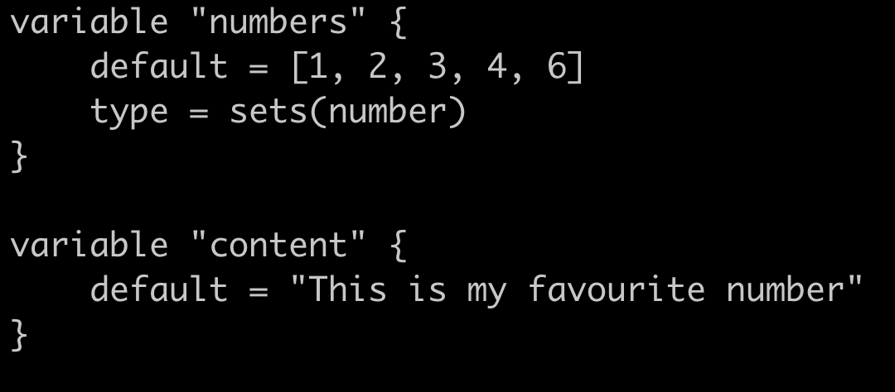

**Duplication example**

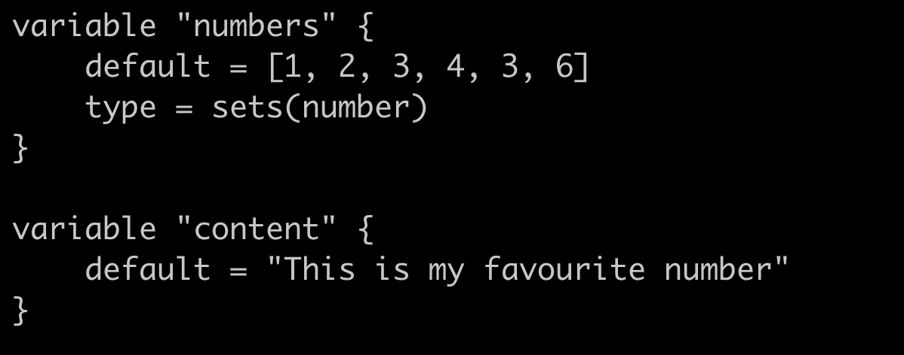

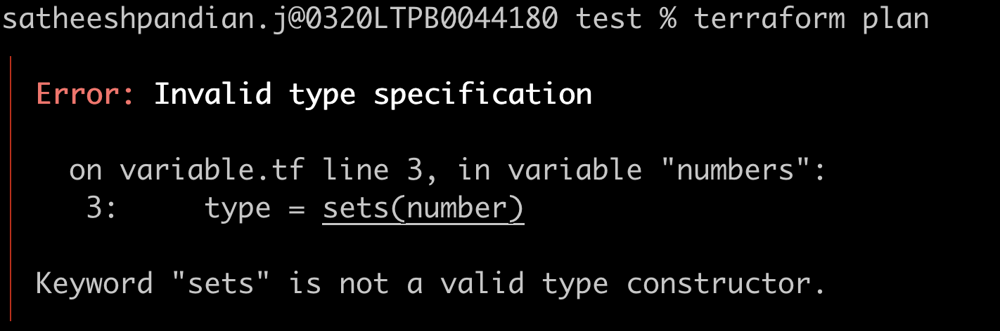


***Object***

Object is a custom variable type. You can have combination all other variable type using object.

```variable.tf
variable "player" {
     default = {
        "name" = "Satheesh"
        "age" = 20
        "favourite_place" = ["Bangalore", "Chennai", "Mumbai"]
        "working_location" = {
            "state" = "Karnataka"
            "city" = "Bangalore"
        }
     }
     type = object({
        "name" = string
        "age" = number
        "favourite_place" = list(string)
        "working_location" = map(string)    
     })
    description = "Map of numbers"
}
```
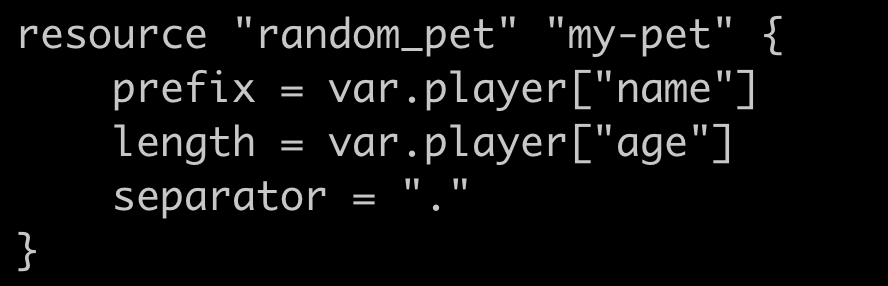


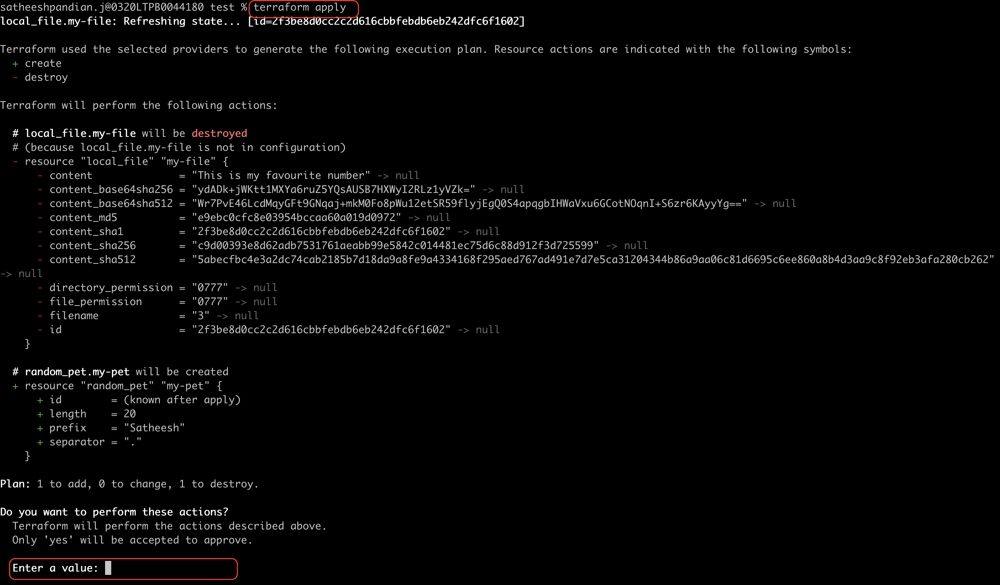

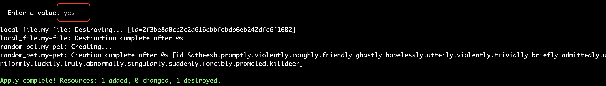


***Tuples***

This is similar to list except that tuples can have all variable type.

```variable.tf
variable "names" {
    default = [5, 7, "Satheesh", true, 4]
    type = tuple([number, number, string, bool, number])
    description = "Tuple example"
}
```

**Ways to use variable in terraform**

1. We can create `variable.tf` file and put all the variables and then use it in `main.tf`. 
You can refer all the above cases for this type of usage.

2. During runtime via terminal (Interactive Mode):
   
    To do this, we need to create a `variable.tf` file. But we don't need to update any variable, just keep at empty.
```variable.tf
variable "filename" {
}
variable "content" {
}
```
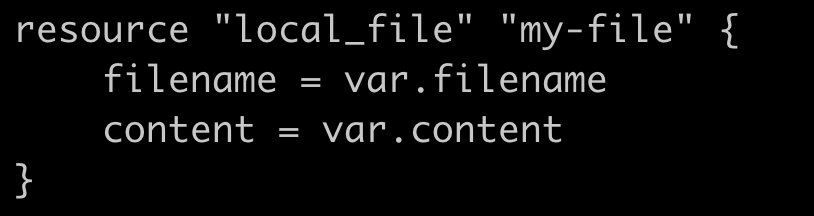

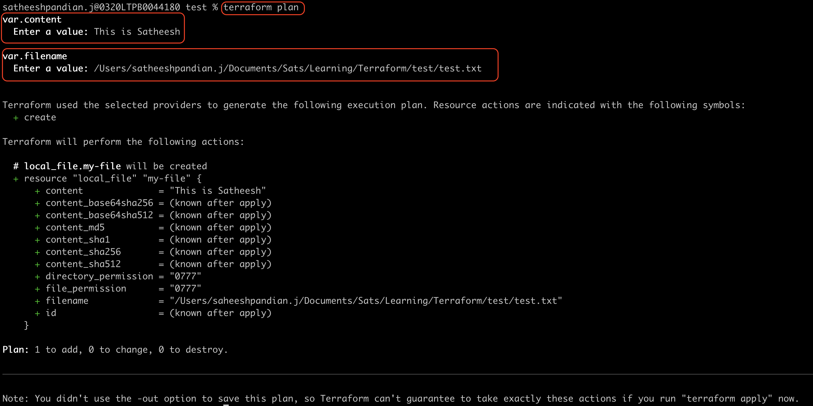

3. Via command line arguments

    To do this, we need to create a `variable.tf` file. But we don't need to update any variable, just keep at empty.
```variable.tf
variable "filename" {
}
variable "content" {
}
```
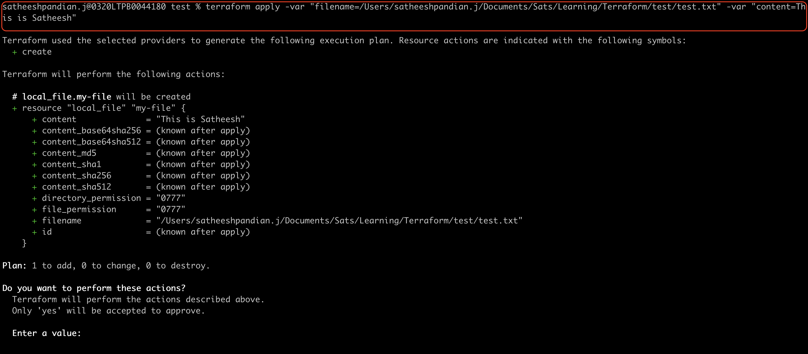

4. Via environmental variables

    To do this, we need to create a `variable.tf` file. But we don't need to update any variable, just keep at empty.
```variable.tf
variable "filename" {
}
variable "content" {
}
```

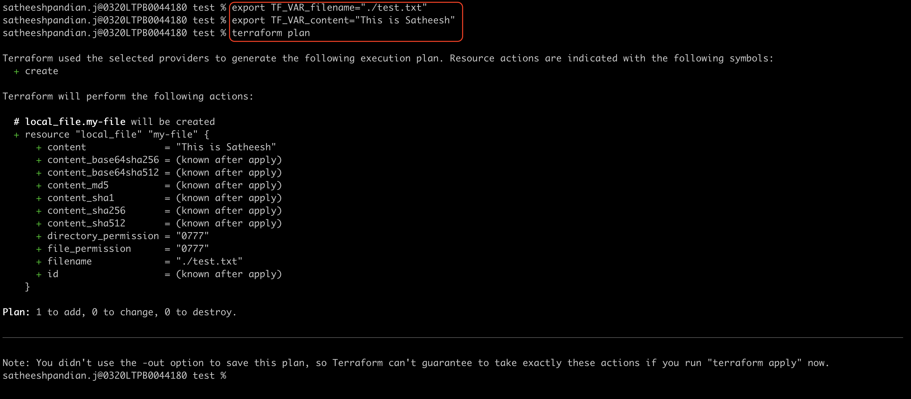

5. Via variable definition files

    Variables are loaded from `terraform.tfvars` file. This filename can be anything, but the extension should be `terrform.tfvars` or `terraform.tfvars.json` or `.auto.tfvars` or `.auto.tfvars.json`. Then it will be autoloaded. 
In case, if you have variable definition file named as `satheesh.tfvars`, then you need to pass this via command line arguments.

```
terraform plan -var-file satheesh.tfvars
```


   To do this, we need to create a `variable.tf` file. But we don't need to update any variable, just keep at empty.

```variable.tf
variable "filename" {
}
variable "content" {
}
```

```terraform.tfvars
filename="./test.txt"
content="This is Satheesh"
```


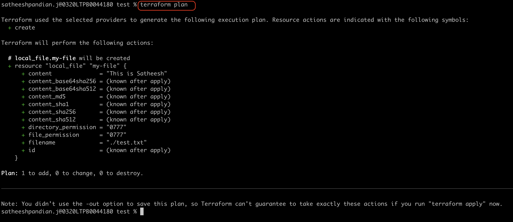


**Variable Definition Precedence**

Highest priority to lowest is as follows:
   1. command line arguments (Ex : `-var "filename=./test.txt"`)
   2. *.auto.tfvars or *.auto.tfvars.json (* -> can be anything. If there are more than one file, then it will be applicable by alphabetical order)
   3. terraform.tfvars or terraform.tfvars.json
   4. environmental variables


**Resource Attributes**

We want to get the value from one configuration (output of it) and pass it to another configuration, this can be achieved.

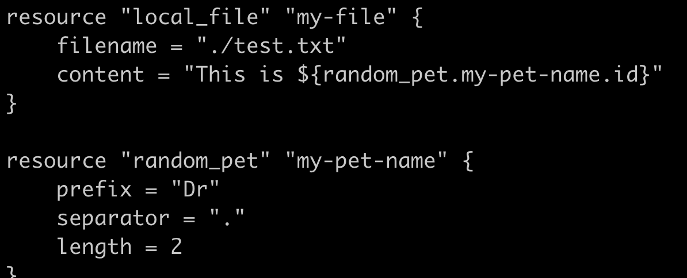

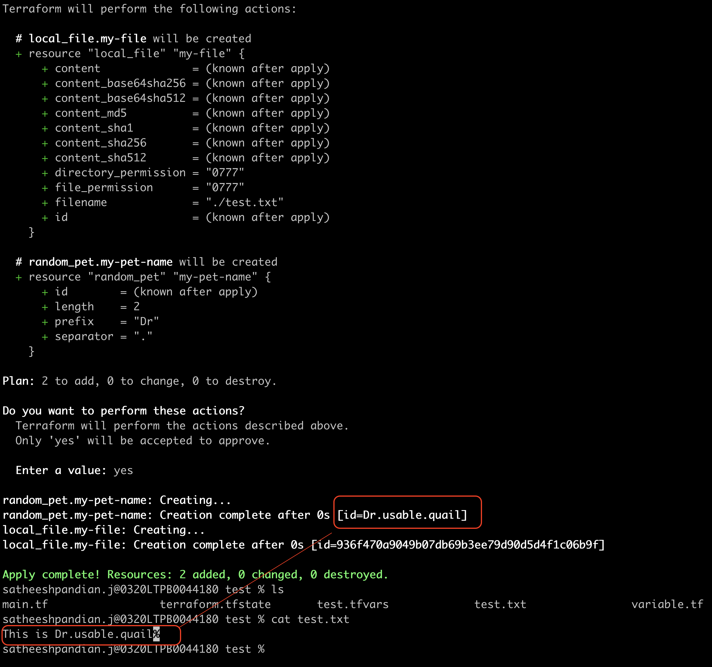

Here, `local_file` resource depends on `random_pet` resource. So, terraform will create the resource for random_pet first and then local_file.
While destroying, `local_file` will be deleted first and then `random_pet`.
This will be taken care by terraform itself. <mark>This is known as implicit dependency.</mark>

We can specifically mention the dependency in the configuration file like below. This is called as explicit dependency.
```html
 resource "local_file" "my-file" {
       filename = "./test.txt"
       content = "This is Satheesh"
       depends_on = [random_pet.my-pet-name.id]
}
  
resource "random_pet" "my-pet-name" {
       prefix = "Dr"
       separator = "."
       length = 2
} 
```


