#Terraform Basic Commands

**Terraform Validate**

This command helps you to validate the configuration file. It will validate all the configuration files available in a 
directory and tells you if there is any issue. If all the files are properly updated, then it will tell you th success message.
<mark>Remember, this will validate only the syntax</mark>

***Syntax***

```html
terraform validate
```

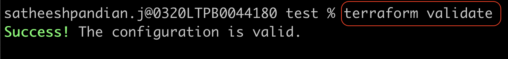

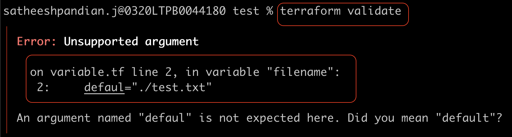

**Terraform Format**

This command helps you to format the configuration file in canonical format. This is mainly useful for readability.

***Syntax***

```html
terraform fmt
```

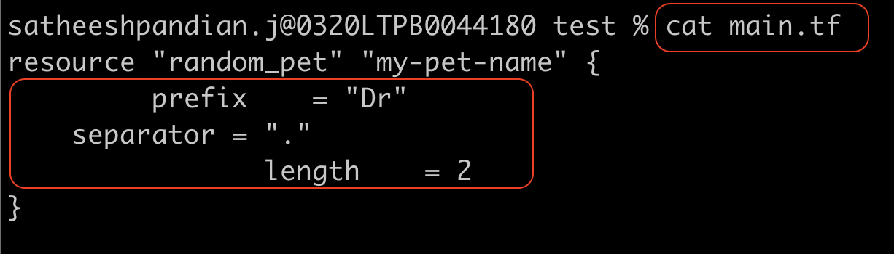

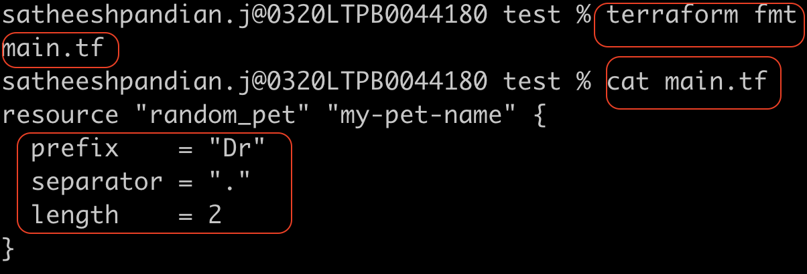


**Terraform Show**

This command helps you to show the current state of the infrastructure resource including all attributes created by Terraform.

***Syntax***

```html
terraform show
```

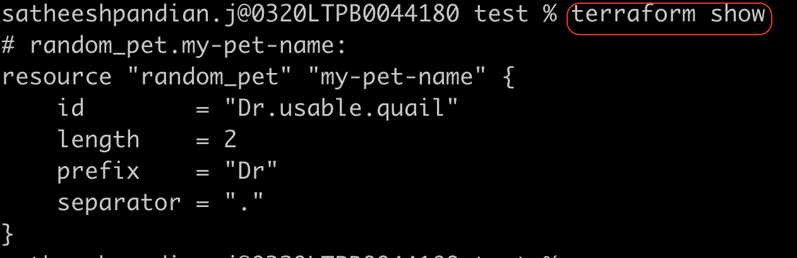


`terraform show -json` command will show the current state of the infrastructure resource in JSON format

```html
terraform show -json
```

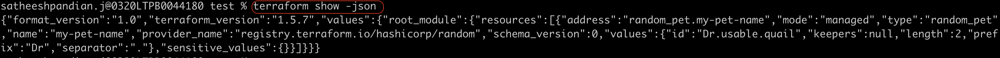


**Terraform Provides**

This command helps you to list out all the providers used in the configuration directory.

***Syntax***

```html
terraform providers
```
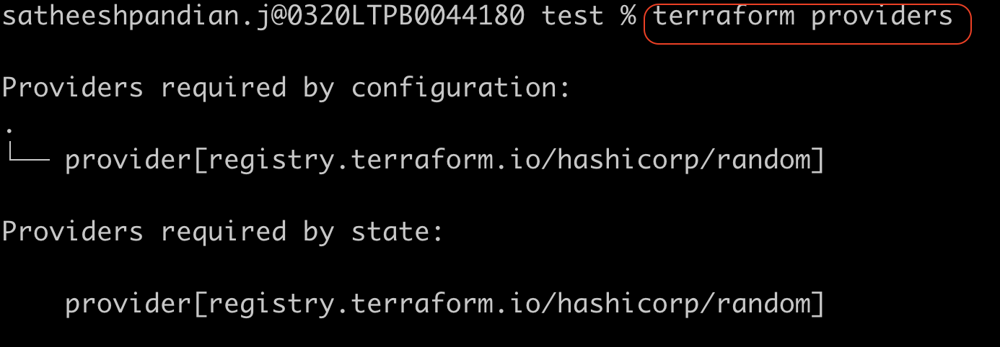


**Terraform Provides Mirror**

This command helps you to copy provider plugins required for the current configuration to another directory.

***Syntax***

```html
terraform providers mirror <NEW DIR PATH>
```
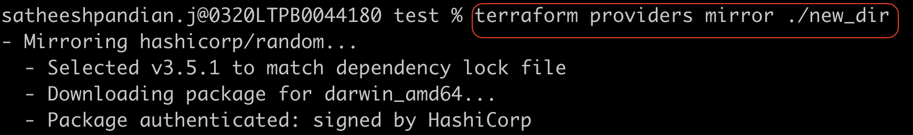

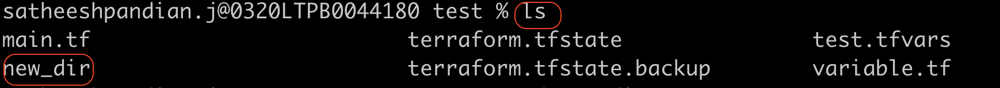

In the above example, all the provider plugins are copied from `test` directory to `new_dir` directory.


**Terraform Refresh**

This command helps you to sync terraform with real world infrastructure.

***Syntax***

```html
terraform providers mirror <NEW DIR PATH>
```

**Terraform Refresh**

This command helps you to refresh the configuration file if any changes made.

***Syntax***

```html
terraform refresh
```
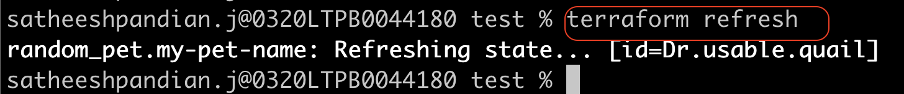


**Terraform Graph**

This command helps you to create a visual representation of the dependencies and configuration.
Output is graph generated in a DOT format.

***Syntax***

```html
terraform graph
```

If we have installed graphviz, then we can generate a graph which tells the dependencies and configuration details in diagram.

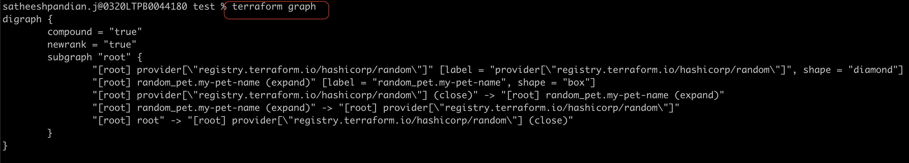

```html
terraform graph | dot -Tsvg > graph.svg
```

`graph.svg` can be viewd in any browser.

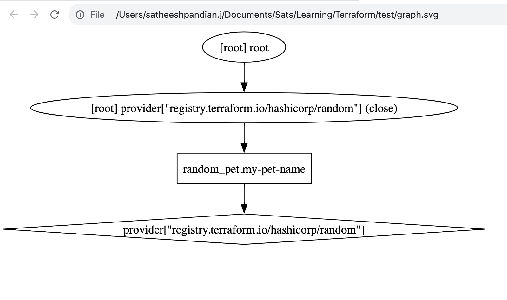

**Mutable Vs Immutable**

If a software wants to upgrade from one version to another version, it can be done via manual approach, ansible, or shell script.
But this can be done during maintenance window (if there is only server). In case, if we are using multiple server, we can 
upgrade the server one by one for HA. <mark>This is called as in place update. This is mutable infrastructure</mark>. 

If there are multiple servers in the infrastructure, and each server has different version of same software. <mark>Then this is called 
as Configuration drift.</mark>

If there are multiple servers in the infrastructure and while upgrading the software, we spin up new server with new version and 
once that is in place and working, we can destroy one of the old server which running with old version. Similar approach
can be taken for other servers too. <mark>This is called as Immutable infrastructure.</mark> Remember, while upgrading 
if any failures occur, then old server will still be in place. <mark>Terraform follows immutable approach.
However, there is only one difference. By default, Terraform first destroy the resources first and then will create a new resource </mark>. However,
it can be changed via lifecycle rules.

