#Terraform

Terraform is a IAC tool, specifically <mark>used for provisioning</mark>. 
It is an open source tool <mark>developed by Hashicorp</mark>.
It is allowing us to build image, manage and destroy infrastructure in few minutes. 
The biggest advantages of terraform is that it can <mark>support multiple platforms</mark> including private and public cloud providers such as Azure/AWZ/GCP/VMware/Physical machines.

Providers (AWS/Azure/GCP etc.,) helps terraform to manage the third party platforms through their APIs. 
Terraform uses HCL(Hashicorp Configuration Language) which is very simple language to define the infrastructure <mark>resources to be provisioned as a block of code.</mark>
All infrastructure resources are defined in configuration files with `tf` extension.
The source code can be maintained in source control system. So, it can be distributed to other teams as well.

`NOTE: Remember, every objects that terraform manages known as resources. 
Terraform manages the object's entire life cycle starting from provisioning to destroying`

Terraform has <mark>three phases</mark>
<ul>
    <li>Init</li>
    <li>Plan</li>
    <li>Apply</li>
</ul>

In `init` phase, <mark>terraform initiates the project and identify the providers.</mark>
This provider will be used in the targeted environment.

In `plan` phase, <mark>terraform creates the plan to get the resources to target state.</mark>

In `apply` phase, <mark>terraform makes necessary changes to the plan to get the resources to desired state in the target environment.</mark>


Terraform maintains the record that state of the infrastructure.
Based on this record, it can decide what action can be taken when updating the resources in particular platform such as AWS and Azure.

It is Terraform's responsibility to maintain the defined state for all the resources in the code at all time.

Terraform can read the attribute of the existing resources by configuring datasource. This can be used to configure other datasource within Terraform.
It can also import other resources outside of Terraform and manages them.

##<span style="color:red">H</span>ashiCorp <span style="color:red">C</span>onfiguration <span style="color:red">L</span>anguage (HCL)

HCL consists of <mark>blocks and arguments.</mark>
```doctest
<BLOCK> {
    <ARGUMENTS>
}
```
<mark>Arguments will be in key value format and represents configuration data.</mark>
```doctest
<BLOCK> {
    <KEY1>=<VALUE1>
    <KEY2>=<VALUE2>
}
```
`Block` contains the information of infrastructure platform and set of resources to be created within the platform.

`Block` contains `resource name` and `resource type`.

**Example**

Let us see an example to create a file in local laptop/desktop using terraform.

```local-file-creation.tf
resource "local_file" "names" {
    filename = "/Users/satheeshpandian.j/Documents/Sats/Learning/Terraform/names.txt
    content = "Satheesh \nPandian \nJeganathan"
}
```

**Explanation**

`resource "local_file" "names"` => Block

Below is the argument
`filename = "/Users/satheeshpandian.j/Documents/Sats/Learning/Terraform/names.txt"
content = "Satheesh \nPandian \nJeganathan"
`

Type of the block is `resource` which is identified by keyword `resource` in the beginning of the block.

`local_file` => `local` is provider + `file` is type of resource

`local_file` =>  Resource type we want to create. This is fixed value and will be changed based on the provider.

`names` => Resource name. It can be anything.

As it is file type of resource and needs to be a local type provider, `filename` is the mandatory argument. Refer this <a href="https://registry.terraform.io/providers/hashicorp/local/latest/docs/resources/file">link</a>

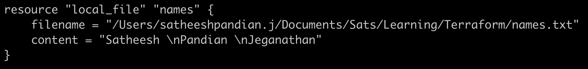

Now, we need to run the file (local-file-creation.tf) we created. 
To do so, we need to initialize the project using `terraform init` command

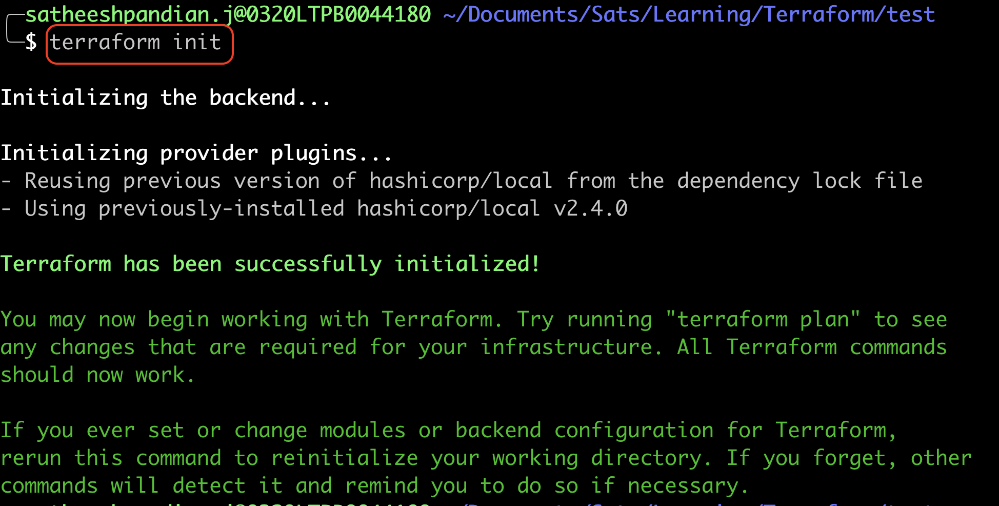

Next, we need to ensure if whatever resource needs to be created, will it be there. To check this, you need to run `terraform plan` command

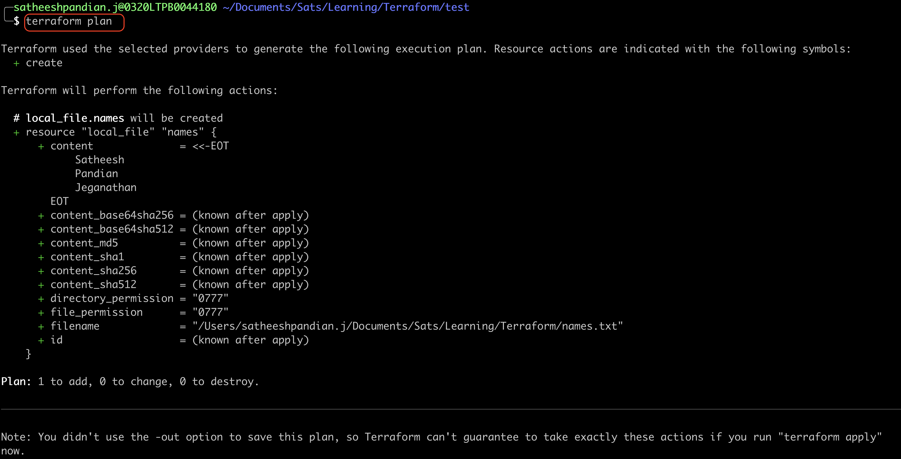

If you observe the above output, you can see the filename, along with content (NOT VISIBLE as it is not yet applied), file permission etc. 
Terraform will create additional attributes as an arguments alone with user provided attributes.

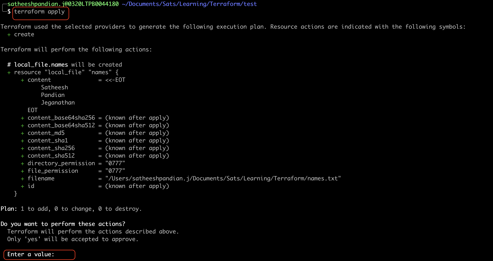

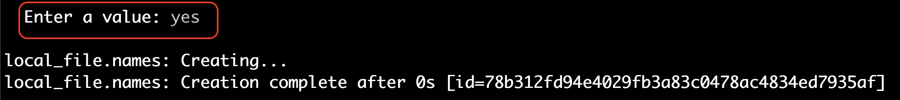

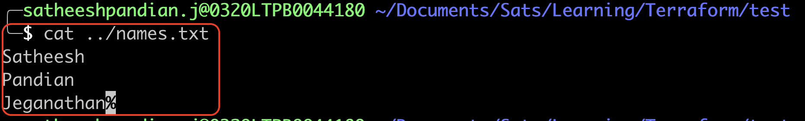

Now, let us update the resource we created (local file).

```local-file-creation.tf
resource "local_file" "names" {
    filename = "/Users/satheeshpandian.j/Documents/Sats/Learning/Terraform/names.txt"
    content = "I am Satheesh and this is terrform update example"
}
```

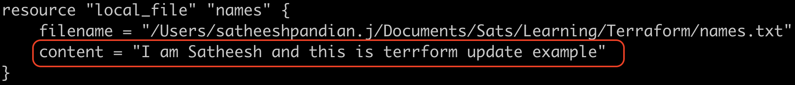

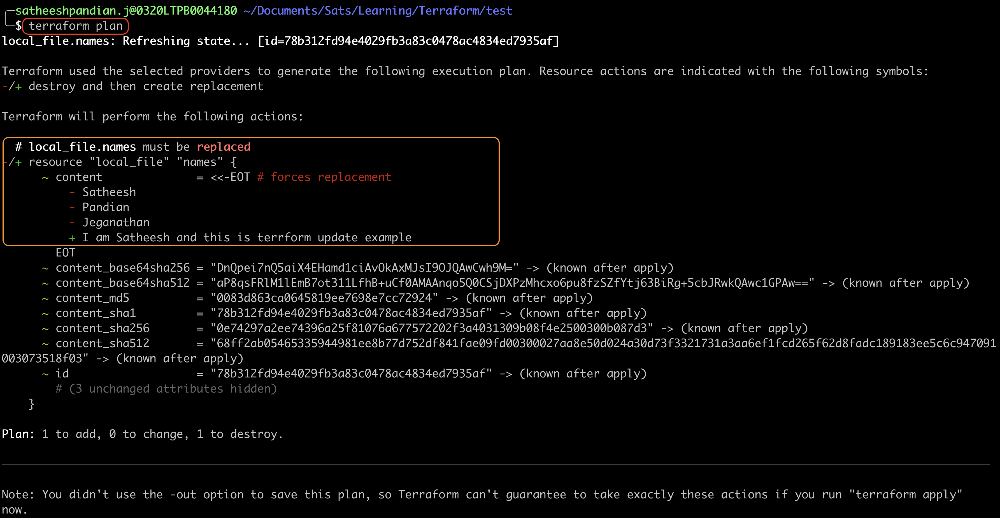

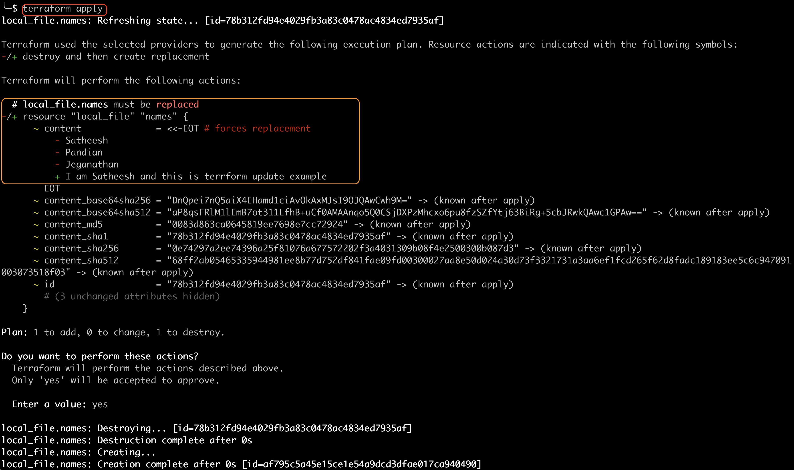


Now, let us destroy the resource we created (local file).

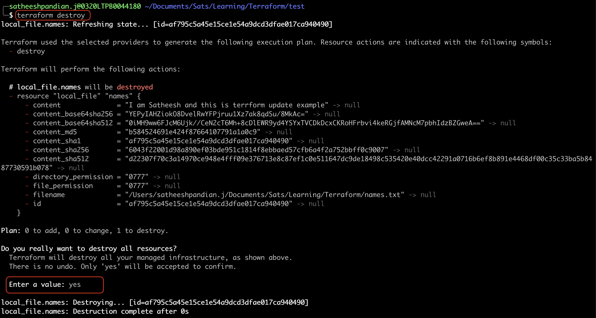

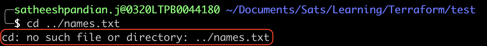


To hide the file content during `terraform plan / terraform apply`, use the below code
```html
resource "local_sensitive_file" "games" {
    filename = "/Users/satheeshpandian.j/Documents/Sats/Learning/Terraform/names.txt"
    content = "I am Satheesh and this is terraform update example"
}
```

***For AWS Provider***
```html
resource "aws_instance" "app_server" {
  ami           = "ami-830c94e3"
  instance_type = "t2.micro"

  tags = {
    Name = "ExampleAppServerInstance"
  }
}
```

| Provider |Link |
|----------|-----|
| AWS      |https://registry.terraform.io/providers/hashicorp/aws/latest |
| Azure    |https://registry.terraform.io/providers/hashicorp/azurerm/latest     |
| Google   |https://registry.terraform.io/providers/hashicorp/google/latest     |


