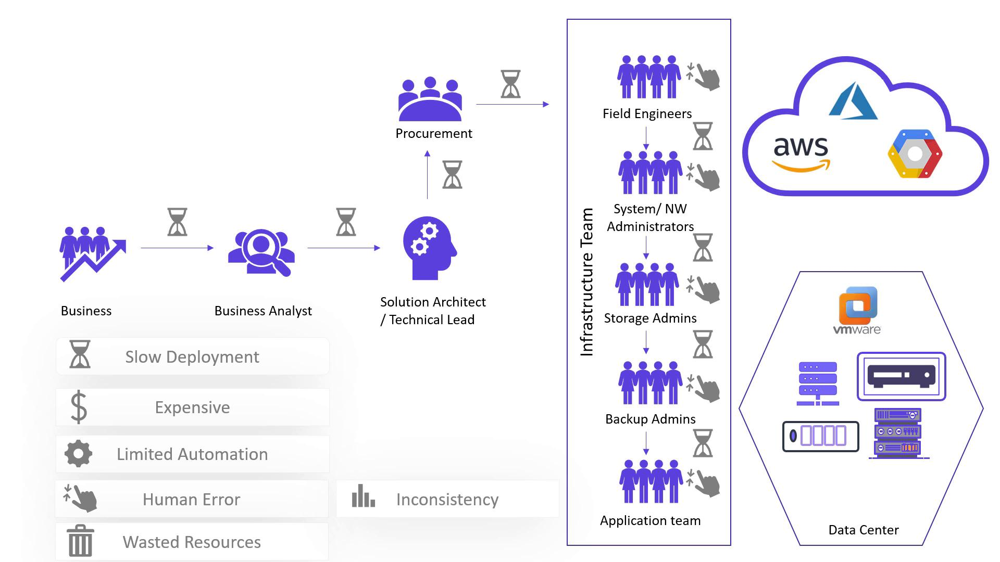

# Challenges with Traditional IT Infrastructure

Imagine you are building an application for your business. This application has to be hosted for customers to use.
Your business team gathers the business requirements and passes it to business analyst.
Then, business analyst analyzes the requirements and transforms them to technical specification.
Your solution architect reads the technical specification and
creates the infrastructure, designs the deployment architecture for your application to be hosted. 
This design includes the number of servers required, type of servers, configuration, quantity, etc.

Once the request for server procurement to be created, it takes a few weeks to a few months to be arrived.
After arriving the servers, multiple teams need to be involved to set up the configuration, networking and, storages, etc.
Manually will do this.

## Key challenges of the traditional deployment model

**1. Turn around time** - Takes a few weeks to a few months to be set up the complete infrastructure 
**2. Scalability** - Scaling the infrastructure whenever required is really difficult 
**3. High cost** - All the server procurement cost, maintenance cost are high
**4. Under utilization** - Some servers are not fully used. Remaining resources are waste.
**5. Human error** - As a multiple team involved to set up the environment, high chances of human error is possible

