# Lifecycle Rules

By default, Terraform first destroys the resources first, and then will create a new resource.

**Example**

You have local file creating configuration file your directory, and the resource was provided already.
Now, you want to make changes in the content of the file like below
```main.tf
resource "local_file" "my-file" {
    filename="./test.txt"
    content="Satheesh Pandian" // earlier it is "Satheesh"
}
```

When you run `terraform apply` command. It destroys the existing file first, and then it will create a new one.

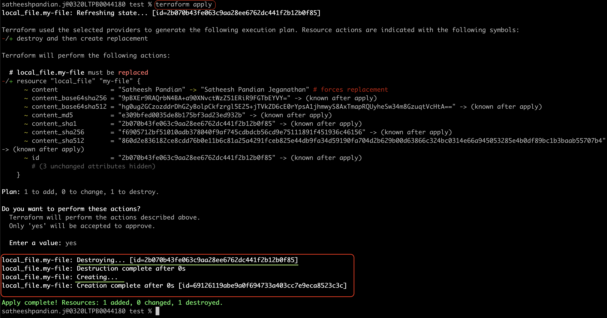

***Create first and Destroy then***

If you want to change this behavior, you can use lifecycle rules.

```main.tf
resource "local_file" "my-file" {
    filename="./test.txt"
    content="My SRE Journey" // earlier it is "Satheesh Pandian Jeganthan"
    
    lifecycle {
        create_before_destroy = true
    }
}
```

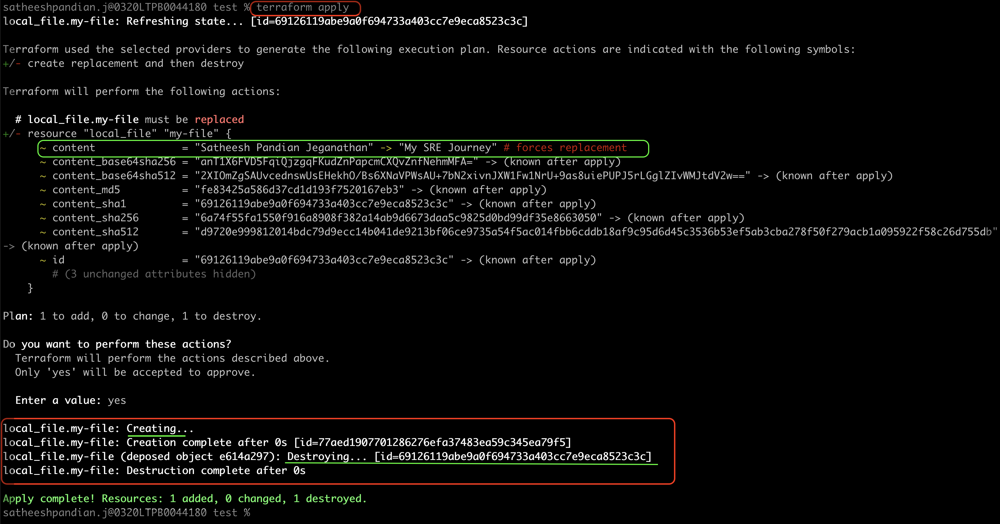

***Do not destroy***

If you DO NOT want to destroy any resource, then you need to use the below lifecycle rules.
This will be used when you deal with a database.
Most of the time, we DO NOT want to delete a database while changing something. 
So, you need to update lifecycle rule with `prevent_destroy = true`.

```main.tf
resource "local_file" "my-file" {
    filename="./test.txt"
    content="My SRE Journey" // earlier it is "Satheesh Pandian Jeganthan"
    
    lifecycle {
        prevent_destroy = true
    }
}
```

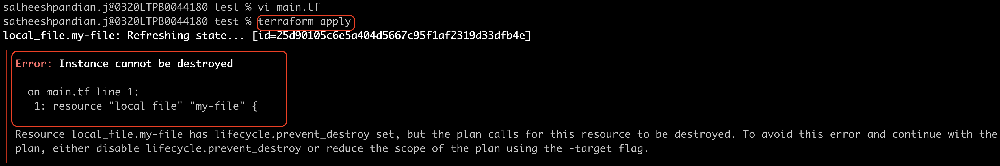


`terraform destroy` command still destroys the resource even if you mentioned lifecycle rule with `prevent_destroy = true` 
in the configuration file.

***Ignore changes***

If you DO NOT want to create any resource in case of any particular attribute change. In the below
example, I am making changes in `content`

```main.tf
resource "local_file" "my-file" {
    filename="./test.txt"
    content="Satheesh Pandian Jeganthan" // earlier it is "I am SRE in Bangalore"
    
    lifecycle {
        ignore_changes = [content] // you can add any number of attribute in the list
    }
}
```

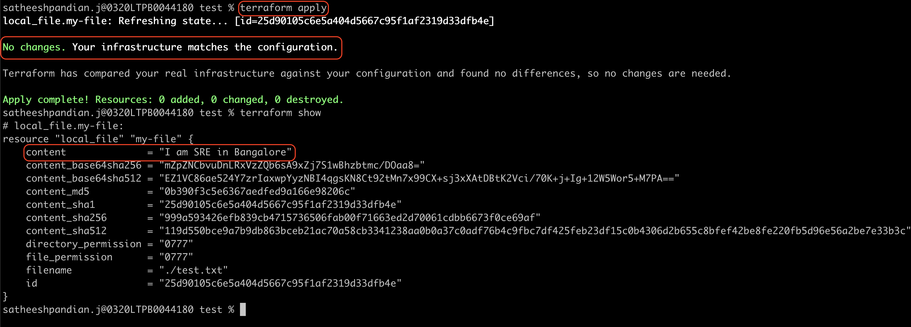


`ignore_changes = all` <mark>means that it won't create any resource even if there is any change in any attribute.</mark>

**QUICK SUMMARY**

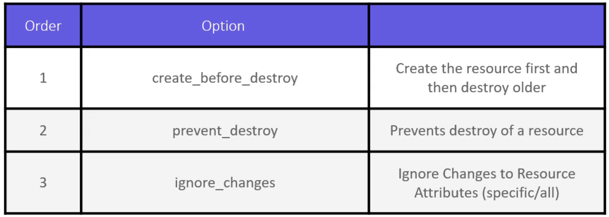

<mark>It is better NOT to use `create_before_destroy = true` lifecycle rule for a local file 
because the rule will create the local file first and the same file to be destroyed during the recreate operation.</mark>

**Data Sources**

If you want to read the data from any file that is in your current configuration directory,
but not created/maintained by terraform.
In that case, you can use that file as a data resource.

```
>cat data.txt
I am Satheesh from Bangalore and I am working as Sr.SRE in a bank.
```

The above file is created manually without using terraform commands. Also, terraform does not have any information 
about this file so far.

```html
resource "local_file" "my-file" {
    filename = "./test.txt"
    content = data.local_file.my-data.content
    lifecycle {
        create_before_destroy = true
    }
}
    
data "local_file" "my-data" {
    filename="./data.txt"
}
```

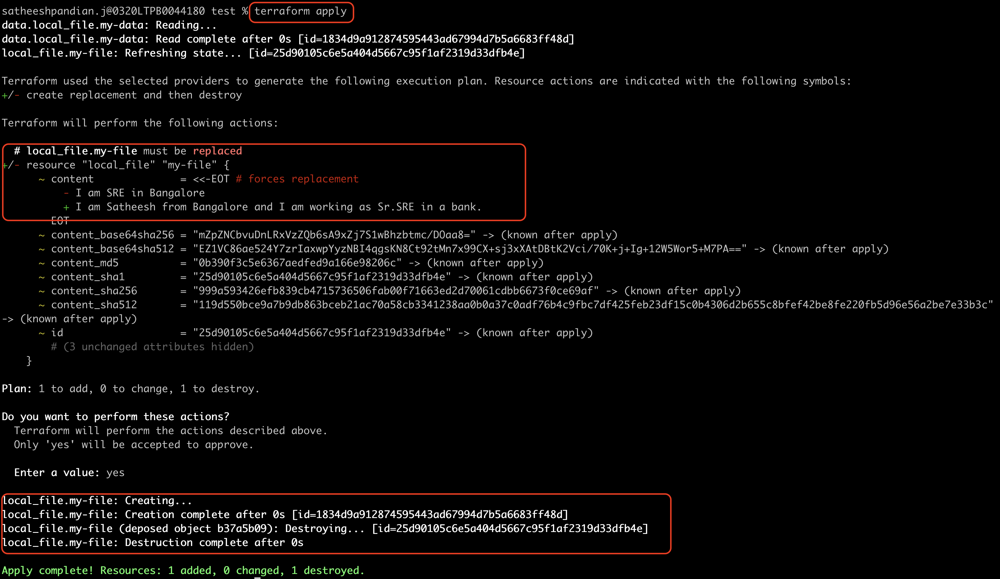

<mark>Remember, you CANNOT do create/update/destroy for data sources. You can ONLY read the data source</mark>

**Meta Argument - Count**

```html
resource "local_file" "my-file" {
    filename = "./test.txt"
    content = "Satheesh"
    count = 3
}
```

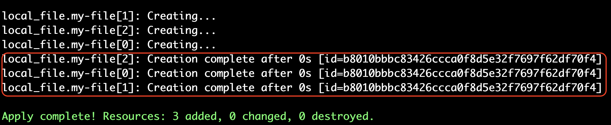

However, the problem is here that there is ONLY one file created instead of 3. This is because the filename 
is not unique. Hence, terraform is recreated the same file again and again.

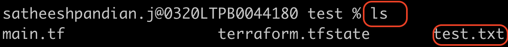

Hence, we need to create three different files.
Here, I used a variable configuration file for creating three files and modified
configuration file to read the filename from variable configuration.
```
variable filename {
    default = ["./test.txt","./sample.txt","./exam.txt"]
}
```

```
resource "local_file" "my-file" {
    filename = var.filename
    content = "Satheesh"
    count = 3
```

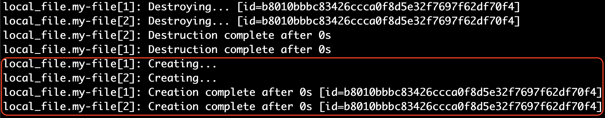

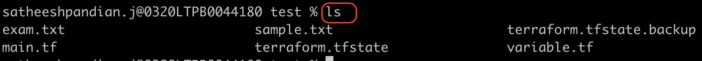

In the above example, even if you have 100 arguments in a variable configuration file,
this will ALWAYS create three files as we hardcoded `count = 3`.
To create the number of files defined in a variable configuration file, we need to update the main
configuration file to pick the length of the list variable.

```
resource "local_file" "my-file" {
    filename = var.filename
    content = "Satheesh"
    count = length(var.filename)
```

**For - Each**

``` main.tf
resource "local_file" "my-file" {
    filename = each.value
    for_each = var.filename
    content=""
```

``` variable.tf
variable "filename" {
    default = ["./test.txt","sample.txt","goal.txt"]
}
```

We can create three files using `for_each` meta argument as well.
However, <mark> `for_each` is expecting a set or map type in the variable configuration file.
</mark>
Hence, a variable file needs to be updated like below

``` variable.tf
variable "filename" {
    type=set(string) # should be added to convert the list type to set type
    default = ["./test.txt","sample.txt","goal.txt"]
}
```

or 

``` main.tf
resource "local_file" "my-file" {
    filename = each.value
    for_each = toset(var.filename)
    content=""
```

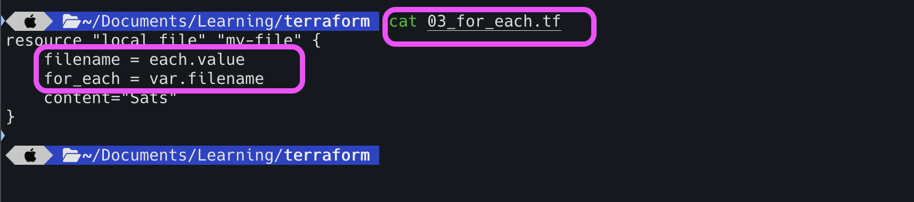

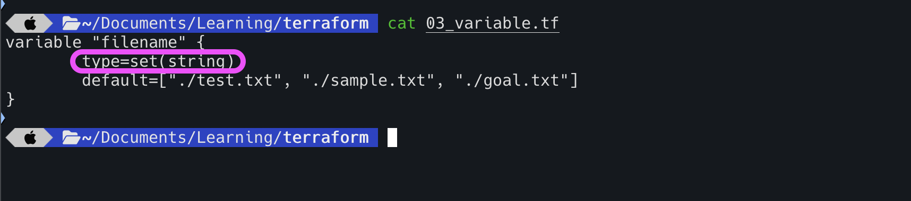

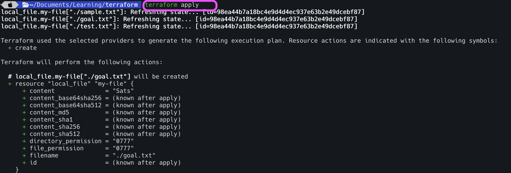

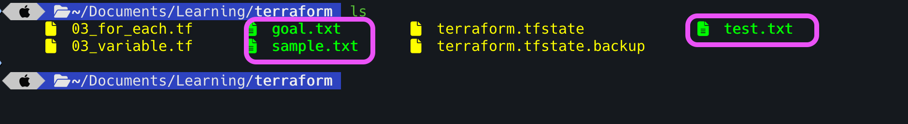

As seen in the snapshot, there are three files have been created.

We can do the same as below as well.

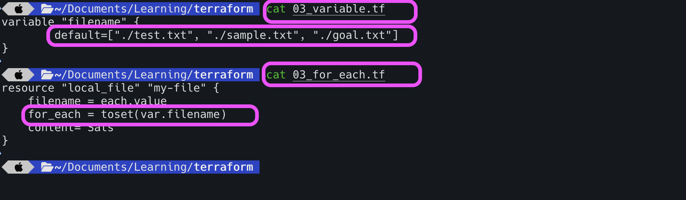


As seen in the snapshot, there are three files have been created.


