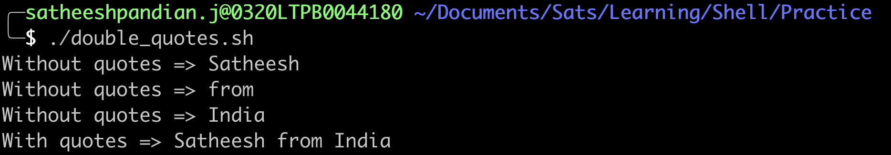

## Tips and Simple Code Snippets

### Use of curly braces {}
* If you want to concatenate the variable value with other strings/numbers, then curly braces for variable is mandatory.

```bash
weight=71
# Without curly braces for variable weight
echo "Without curly braces = My weight is $weightkgs"

# With curly braces for variable weight
echo "With curly braces = My weight is ${weight}kgs"

```

### Use of double quotes ""
* If you have a variable contains spaces, then double quotes for variable will process the variable as a whole. If you dont put double quotes for variable, then it will split the variable using the space.
```bash
#!/bin/bash
sentence="Satheesh from India"
# Without quotes for variable sentence
for word in ${sentence}
do
  echo "Without quotes => ${word}"
done

# With quotes for variable sentence
for word in "${sentence}"
do
  echo "With quotes => ${word}"
done
```


### Use of basename command
It is a shell command used to extract the filename portion of a file path. It takes a path as input and returns only the final component of that path, removing any preceding directory path information.
It is useful when you only need to work with the file name and don’t require the full path.

For example, if the path is /home/user/documents/report.docx, basename will return report.docx. 
```bash
#!/bin/bash
# Below is the full path for a file
echo "ABSOLUTE PATH for a FILE => /User/satheeshpandian.j/Documents/Sats/Learning/Shell/Practice/if_exit.sh"
# Below command is just fetch the filename
file_name=$(basename /User/satheeshpandian.j/Documents/Sats/Learning/Shell/Practice/if_exit.sh)
echo "FILE NAME => ${file_name}"
```


If you need the filename excluding the extension, then the command is
```bash
basename /User/satheeshpandian.j/Documents/Sats/Learning/Shell/Practice/if_exit.sh .sh
```


### Print the file names in current directory
```bash
#!/bin/bash
# print all the files in the current directory
for f in * 
do 
  echo "$f"
done
```
